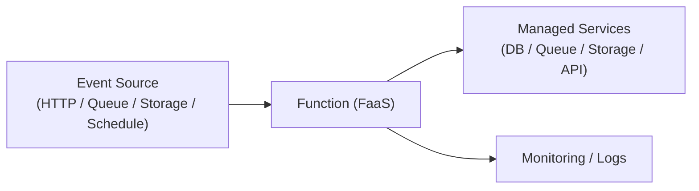

# 🧩 Serverless Architecture

## ✅ このスタイルの概要

**サーバ管理を隠蔽し、イベント駆動の Functions（FaaS）を中心に構築するアーキテクチャ。**

## ✅ 解決しようとした問題

- インフラ運用コストの削減
- スケールの自動化
- 不規則な負荷変動への対応

## ✅ 基本思想・ルール

- FaaS（Lambda / Cloud Functions など）によるイベント駆動
- マネージドサービスを組み合わせた構成
- スケールは自動、従量課金
- ステートレス関数が基本

### 3.1 概念図（Conceptual Diagram）

## ✅ 得意なアプリケーション

- イベント駆動処理（ログ・通知・変換）
- バースト負荷が大きい業務
- 小規模 API / BFF / バックオフィスツール

## ✅ 不向きなケース

- 長時間実行のジョブ
- ステートフル処理
- 高頻度トラフィックの恒常的大規模サービス（コスト増）

## ✅ 歴史

- AWS Lambda（2014）から普及
- BaaS / FaaS 組み合わせのアーキテクチャへ発展

## ✅ 関連スタイル

- Microservices：粒度の小ささ・疎結合の思想は類似
- Event-driven：FaaS の起点として強く連携

## ✅ 代表的なフレームワーク

- **AWS Lambda / API Gateway / DynamoDB / S3**  
  最も普及している Serverless スタック。

- **Google Cloud Functions / Cloud Run / Pub/Sub**  
  管理不要な実行環境とイベント基盤。

- **Azure Functions**  
  .NET エコシステムとの相性が良い。

- **Vercel Functions / Netlify Functions**  
  Web フロントと近接した Serverless 構成。

## ✅ このスタイルを支えるデザインパターン

- **Observer**  
  イベント（ファイル生成・メッセージ着信）を起点に処理。

- **Command**  
  関数ごとに“単一の操作”を表現。

- **Proxy**  
  API Gateway の認証・認可・スロットリング。

- **Strategy**  
  イベントタイプごとの処理分岐。

## ✅ まとめ

Serverless は  
**「スケール自動化 × 運用最小化」** を実現する、  
クラウド時代の強力な構造スタイルである。
