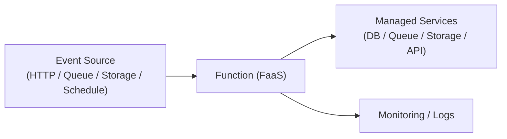

# 🧩 Serverless Architecture

## ✅ Overview

**An architecture that hides server management and is built around event-driven Functions (FaaS).**

## ✅ Problems Addressed

- Reduction of infrastructure operation costs.
- Automation of scaling.
- Response to irregular load fluctuations.

## ✅ Basic Philosophy & Rules

- Event-driven by FaaS (Lambda / Cloud Functions etc.).
- Configuration combining managed services.
- Scale is automatic, pay-as-you-go.
- Stateless functions are basic.

### Conceptual Diagram

## ✅ Suitable Applications

- Event-driven processing (Log / Notification / Transformation).
- Tasks with large burst loads.
- Small-scale API / BFF / Back-office tools.

## ❌ Unsuitable Cases

- Long-running jobs.
- Stateful processing.
- Constant large-scale services with high frequency traffic (Cost increase).

## ✅ History

- Spread from AWS Lambda (2014).
- Developed into architecture combining BaaS / FaaS.

## ✅ Related Styles

- **Microservices**: Similar philosophy of small granularity and loose coupling.
- **Event-driven**: Strongly linked as a starting point of FaaS.

## ✅ Representative Frameworks

- **AWS Lambda / API Gateway / DynamoDB / S3**
  Most popular Serverless stack.

- **Google Cloud Functions / Cloud Run / Pub/Sub**
  Execution environment and event infrastructure requiring no management.

- **Azure Functions**
  Good compatibility with .NET ecosystem.

- **Vercel Functions / Netlify Functions**
  Serverless configuration close to Web frontend.

## ✅ Design Patterns Supporting This Style

- **Observer**
  Processing triggered by events (File generation / Message arrival).

- **Command**
  Expresses "single operation" per function.

- **Proxy**
  Authentication / Authorization / Throttling by API Gateway.

- **Strategy**
  Processing branching per event type.

## ✅ Summary

Serverless is a powerful structural style of the cloud era realizing
**"Scale Automation × Operation Minimization"**.
