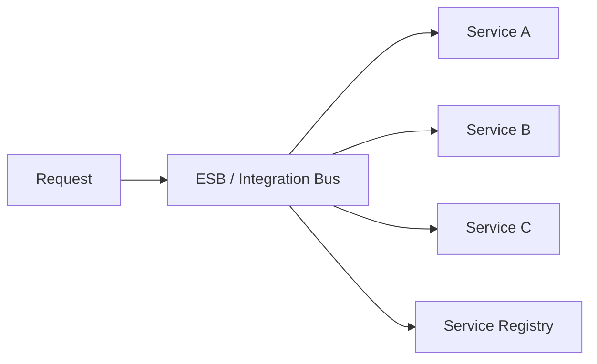

# 🧩 SOA (Service-Oriented Architecture)

## ✅ Overview

**A service splitting approach prior to Microservices, building enterprise systems as a collection of "Services".**

## ✅ Problems Addressed

- Systems within an enterprise become silos and cannot cooperate.
- Cooperation without integration infrastructure (ESB) is extremely difficult.
- Want to standardize heavy enterprise integration.

## ✅ Basic Philosophy & Rules

- Integration by ESB (Enterprise Service Bus).
- Strict contract by SOAP / WSDL / XML.
- Service catalog management.
- Governance-oriented design.

### Conceptual Diagram

## ✅ Suitable Applications

- Integration of mission-critical systems in large enterprises.
- Long-term stable operation of business processes.
- Areas with low change frequency and strong governance.

## ❌ Unsuitable Cases

- Fast-changing Web products.
- Areas where development speed and flexibility are important.
- Cases where lightweight API (REST/gRPC) is sufficient.

## ✅ History

- Spread as the center of enterprise IT in the 2000s.
- Lightweighting advanced by [REST](../integration/rest-grpc-graphql.md) / [Microservices](./microservices.md), currently continuing in limited areas.

## ✅ Related Styles

- **[Microservices](./microservices.md)**: Developed as a lightweight version of SOA.
- **[API Gateway](../integration/api-gateway-bff.md)**: Corresponds as a modern version of SOA's "Entrance".

## ✅ Representative Frameworks

- **Oracle SOA Suite / IBM WebSphere ESB**  
  SOA platforms used for a long time in enterprise IT.

- **Middleware supporting WS-\* (SOAP / WSDL)**  
  Communication infrastructure supporting SOA standards at that time.

- **BizTalk Server**  
  SOA implementation for enterprise integration.

## ✅ Design Patterns Supporting This Style

- **Facade**  
  ESB functions as the entrance of the entire service.

- **Mediator**  
  ESB mediates cooperation between multiple systems.

- **Adapter**  
  Essential when wrapping legacy systems with SOAP/WSDL.

- **Proxy**  
  Message validation / Security application.

## ✅ Summary

SOA remains important in the context of Enterprise IT,  
and is an **architecture specialized for high-governance areas such as finance and mission-critical systems.**
