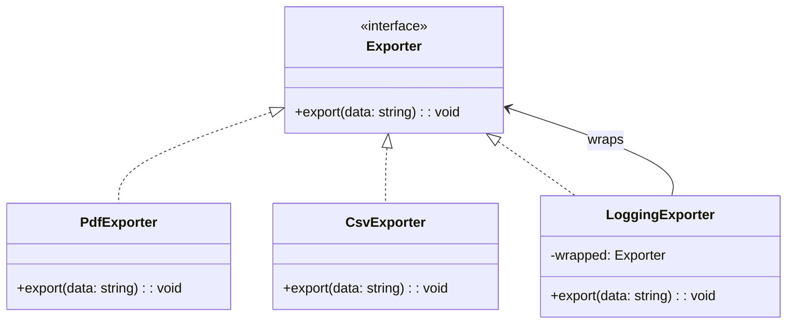

import Tabs from "@theme/Tabs";
import TabItem from "@theme/TabItem";
import CodeBlock from "@theme/CodeBlock";

import tsCode from "@site/src/codes/duplicate-logic/ts/rfc_decorator.ts";
import phpCode from "@site/src/codes/duplicate-logic/php/rfc_decorator.php";
import pyCode from "@site/src/codes/duplicate-logic/py/rfc_decorator.py";

# 🧩 Decorator Pattern

## ✅ Intent

- Wrap additional behavior **around an existing process** in a layered structure
- Add functionality through **composition**, not inheritance

## ✅ Motivation

- Add logging to the existing `export` logic **without modifying it**
- Additional behaviors can be **combined flexibly**

## ✅ When to Use

- When you want to reuse cross-cutting concerns like logging, validation, or permission checks

## ✅ Code Example

<Tabs groupId="language">
  <TabItem value="ts" label="TypeScript">
    <CodeBlock language="ts">{tsCode}</CodeBlock>
  </TabItem>
  <TabItem value="php" label="PHP">
    <CodeBlock language="php">{phpCode}</CodeBlock>
  </TabItem>
  <TabItem value="python" label="Python">
    <CodeBlock language="python">{pyCode}</CodeBlock>
  </TabItem>
</Tabs>

## ✅ Explanation

This code applies the `Decorator` pattern to dynamically add additional functionality (logging)  
to an existing feature (data export).  
The `Decorator` pattern allows responsibilities to be added to objects **at runtime** without modifying their structure,  
providing a flexible alternative to subclassing.

### 1. Overview of the Decorator Pattern

- **Component**: Defines the common interface for the core functionality

  - Represented by `Exporter`

- **ConcreteComponent**: Implements the base functionality

  - Represented by `PdfExporter` and `CsvExporter`

- **Decorator**: Implements `Component` and wraps additional behavior around another `Component`

  - Represented by `LoggingExporter`

- **ConcreteDecorator**: A decorator that adds specific new behavior
  - In this code, `LoggingExporter` serves this role

### 2. Key Classes and Their Roles

- `Exporter`

  - Interface defining the export behavior
  - Declares the method `export(data: string): void`

- `PdfExporter`, `CsvExporter`

  - Concrete components implementing `Exporter`
  - Export data in PDF or CSV format

- `LoggingExporter`
  - A decorator class that wraps an `Exporter`
  - Adds logging before and after the export operation

### 3. UML Class Diagram

### 4. Benefits of the Decorator Pattern

- **Dynamic Feature Extension**: Add functionality without modifying existing classes
- **Flexibility**: Combine multiple decorators to layer behaviors
- **Open/Closed Principle**: Extend behavior without altering existing code

This design is highly effective when you need to flexibly enhance functionality at runtime,  
improving code **reusability** and **extensibility**.
