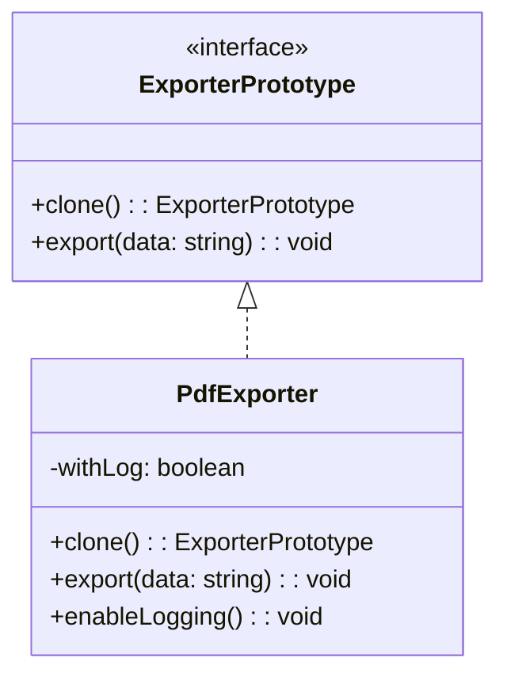

import Tabs from "@theme/Tabs";
import TabItem from "@theme/TabItem";
import CodeBlock from "@theme/CodeBlock";

import tsCode from "@site/src/codes/duplicate-logic/ts/rfc_prototype.ts";
import phpCode from "@site/src/codes/duplicate-logic/php/rfc_prototype.php";
import pyCode from "@site/src/codes/duplicate-logic/py/rfc_prototype.py";

# 🧩 Prototype Pattern

## ✅ Intent

- Reuse pre-initialized logic and structure by **duplicating a prototype instance**
- Clone a base object using `clone()` and apply modifications only where needed

## ✅ Motivation

- When you have logic or structures that are **"almost the same"**, cloning a template improves maintainability and reusability
- Ideal when many similar instances are created from scratch using `new`, and you want to centralize shared setup

## ✅ When to Use

- When the initial state is mostly shared, and only a few properties differ
- Useful for duplicating forms, configuration objects, notification templates, UI layouts, etc.

## ✅ Code Example

<Tabs groupId="language">
  <TabItem value="ts" label="TypeScript">
    <CodeBlock language="ts">{tsCode}</CodeBlock>
  </TabItem>
  <TabItem value="php" label="PHP">
    <CodeBlock language="php">{phpCode}</CodeBlock>
  </TabItem>
  <TabItem value="python" label="Python">
    <CodeBlock language="python">{pyCode}</CodeBlock>
  </TabItem>
</Tabs>

## ✅ Explanation

This code applies the `Prototype` pattern to clone an existing object  
and generate a new instance with the same properties.  
The `Prototype` pattern creates new objects by **copying an existing instance**,  
instead of instantiating a new one from its class directly.

### 1. Overview of the Prototype Pattern

- **Prototype**: Interface that provides a cloning method

  - Represented by `ExporterPrototype` in this code

- **ConcretePrototype**: Implements the prototype interface and provides cloning logic

  - Represented by `PdfExporter`

- **Client**: Uses a prototype object and clones it to create new instances
  - Represented by the call to `baseExporter.clone()`

### 2. Key Classes and Their Roles

- `ExporterPrototype`

  - Common interface for prototypes
  - Declares `clone(): ExporterPrototype` for creating a copy
  - Declares `export(data: string): void` for output functionality

- `PdfExporter`
  - A concrete prototype class
  - Implements `clone` to return a copy of itself
  - Implements `export` to output data in PDF format
  - Provides an `enableLogging` method to customize cloned instances

### 3. UML Class Diagram

### 4. Benefits of the Prototype Pattern

- **Flexible Object Creation**: Create new instances based on existing objects without relying on constructors
- **Avoids Repetitive Initialization**: Use clones to avoid repeating complex setup logic
- **Extensibility**: Adding a new class only requires implementing the `clone` method

This design is highly effective when new objects need to be based on existing ones,  
improving both flexibility and reusability of the codebase.
