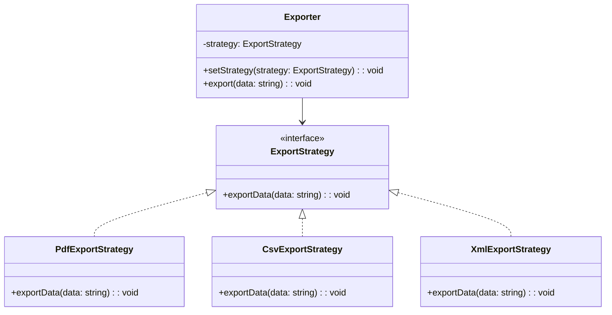

import Tabs from "@theme/Tabs";
import TabItem from "@theme/TabItem";
import CodeBlock from "@theme/CodeBlock";

import tsCode from "@site/src/codes/duplicate-logic/ts/rfc_strategy.ts";
import phpCode from "@site/src/codes/duplicate-logic/php/rfc_strategy.php";
import pyCode from "@site/src/codes/duplicate-logic/py/rfc_strategy.py";

# 🧩 Strategy Pattern

## ✅ Intent

- Externalize the varying part—**the export behavior (strategy)**—while keeping the shared `export()` logic centralized
- Maintain a simple structure by separating the output format logic into strategies

## ✅ Motivation

- Common behavior such as "start log" and "end log" is shared across all exporters
- The only difference is **how the data is exported** (PDF, CSV, XML)
- This combination of a **shared workflow + interchangeable behavior** is naturally handled using the Strategy pattern

## ✅ When to Use

- When multiple output formats or processing modes must be **switched dynamically**
- When output logic should be wrapped in a shared workflow (e.g., logging, formatting, templating)
- When new export formats are expected and the structure needs to support **easy extension**
- When part of the logic should be replaced (e.g., injecting mock logic in tests)

## ✅ Code Example

<Tabs groupId="language">
  <TabItem value="ts" label="TypeScript">
    <CodeBlock language="ts">{tsCode}</CodeBlock>
  </TabItem>
  <TabItem value="php" label="PHP">
    <CodeBlock language="php">{phpCode}</CodeBlock>
  </TabItem>
  <TabItem value="python" label="Python">
    <CodeBlock language="python">{pyCode}</CodeBlock>
  </TabItem>
</Tabs>

## ✅ Explanation

This code applies the `Strategy` pattern to separate the data export logic (PDF, CSV, XML) into strategies (`ExportStrategy`)  
that can be switched dynamically. The `Strategy` pattern encapsulates algorithms as separate classes and allows them to be interchangeable at runtime.

### 1. Overview of the Strategy Pattern

- **Strategy**: Defines a common interface for various behaviors

  - Represented by `ExportStrategy` in this code

- **ConcreteStrategy**: Implements the strategy with specific logic

  - Represented by `PdfExportStrategy`, `CsvExportStrategy`, and `XmlExportStrategy`

- **Context**: Uses a `Strategy` and can dynamically switch it
  - Represented by `Exporter`

### 2. Key Classes and Their Roles

- `ExportStrategy`

  - Common interface for data export behavior
  - Declares the method `exportData(data: string): void`

- `PdfExportStrategy`, `CsvExportStrategy`, `XmlExportStrategy`

  - Concrete strategy classes implementing `ExportStrategy`
  - Each outputs data in a different format (PDF, CSV, XML)

- `Exporter`
  - The context class
  - Receives an `ExportStrategy` in the constructor and executes it via the `export` method
  - Supports dynamic strategy switching via `setStrategy`

### 3. UML Class Diagram

### 4. Benefits of the Strategy Pattern

- **Flexibility**: Easily switch between different behaviors at runtime
- **Single Responsibility Principle**: Each strategy is isolated in its own class, improving maintainability
- **Extensibility**: New strategies can be added by simply implementing `ExportStrategy`

This design is highly effective in scenarios where processing logic needs to be swapped dynamically,  
significantly improving code maintainability and extensibility.
