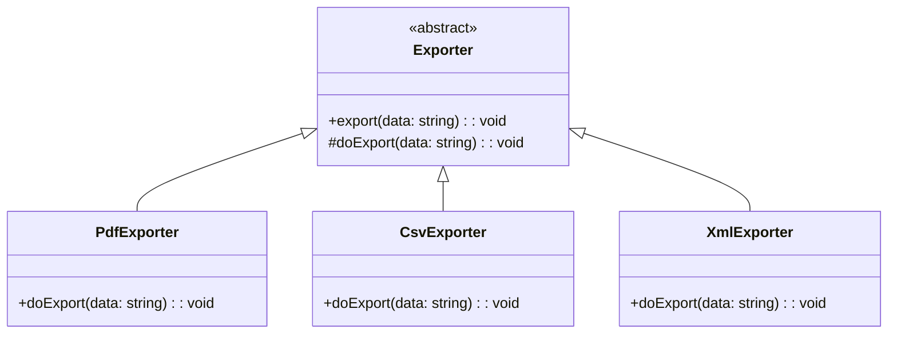

import Tabs from "@theme/Tabs";
import TabItem from "@theme/TabItem";
import CodeBlock from "@theme/CodeBlock";

import tsCode from "@site/src/codes/duplicate-logic/ts/rfc_template.ts";
import phpCode from "@site/src/codes/duplicate-logic/php/rfc_template.php";
import pyCode from "@site/src/codes/duplicate-logic/py/rfc_template.py";

# 🧩 Template Method Pattern

## ✅ Intent

- Define the overall **workflow (template)** in a parent class, and allow **subclasses to override specific steps**
- Consolidate shared logic in the superclass

## ✅ Motivation

- Centralize common logic such as start/end logging
- Clearly expose **"hook points"** where behavior differs

## ✅ When to Use

- When the process flow is fixed but certain steps vary
- When you want to **eliminate duplicated code** across similar operations

## ✅ Code Example

<Tabs groupId="language">
  <TabItem value="ts" label="TypeScript">
    <CodeBlock language="ts">{tsCode}</CodeBlock>
  </TabItem>
  <TabItem value="php" label="PHP">
    <CodeBlock language="php">{phpCode}</CodeBlock>
  </TabItem>
  <TabItem value="python" label="Python">
    <CodeBlock language="python">{pyCode}</CodeBlock>
  </TabItem>
</Tabs>

## ✅ Explanation

This code applies the `Template Method` pattern by defining a shared processing flow in an abstract class,  
and delegating the variable parts to subclasses.  
The `Template Method` pattern defines the **skeleton of an algorithm** in a superclass, while deferring the detailed steps to subclasses.

### 1. Overview of the Template Method Pattern

- **AbstractClass**: Defines the overall algorithm and delegates some steps to subclasses

  - Represented by `Exporter` in this code

- **ConcreteClass**: Implements the abstract methods to provide specific behavior
  - Represented by `PdfExporter`, `CsvExporter`, and `XmlExporter`

### 2. Key Classes and Their Roles

- `Exporter`

  - The abstract class (`AbstractClass`)
  - Defines the `export` method which:
    - Logs the start of the process
    - Calls the abstract method `doExport` for custom export logic
    - Logs the completion of the process
  - The `doExport` method must be implemented by subclasses

- `PdfExporter`, `CsvExporter`, `XmlExporter`
  - Concrete classes (`ConcreteClass`)
  - Implement `doExport` to export data in different formats (PDF, CSV, XML)

### 3. UML Class Diagram

### 4. Benefits of the Template Method Pattern

- **Code Reuse**: Consolidates shared logic in the superclass, reducing duplication
- **Extensibility**: New behaviors can be added by simply implementing the abstract method in a new subclass
- **Consistency**: The overall flow is enforced by the superclass, ensuring uniform behavior

This design is highly effective when multiple processes share a common structure with minor differences.  
It improves maintainability and extensibility by separating invariant logic from customizable steps.
