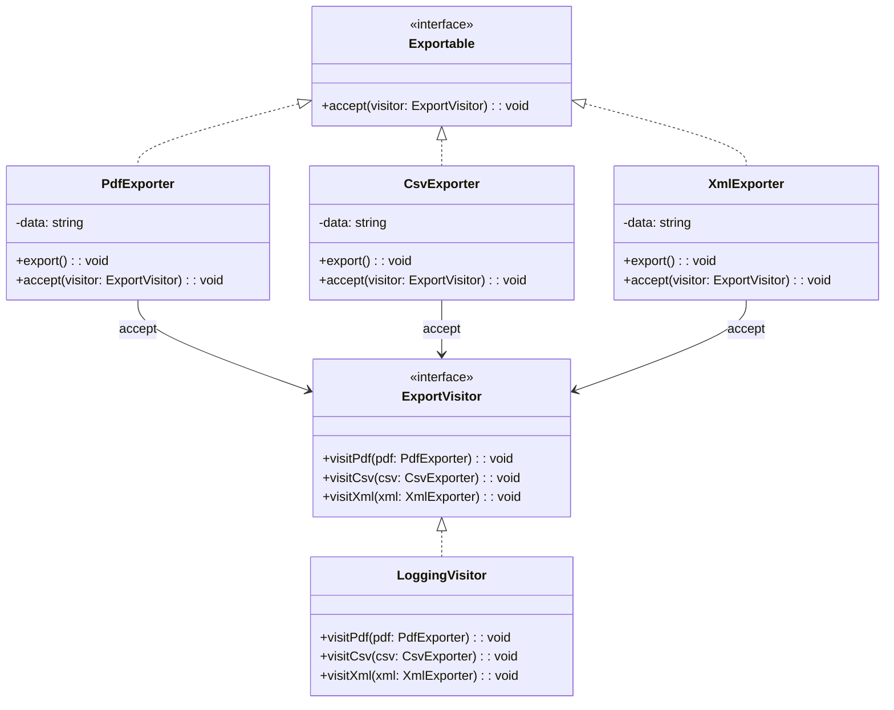

import Tabs from "@theme/Tabs";
import TabItem from "@theme/TabItem";
import CodeBlock from "@theme/CodeBlock";

import tsCode from "@site/src/codes/duplicate-logic/ts/rfc_visitor.ts";
import phpCode from "@site/src/codes/duplicate-logic/php/rfc_visitor.php";
import pyCode from "@site/src/codes/duplicate-logic/py/rfc_visitor.py";

# 🧩 Visitor Pattern

## ✅ Intent

- Separate **operations (visitors)** from the **data structures they operate on**
- Add new behavior **without modifying the data structure itself**

## ✅ Motivation

- Apply different operations externally to elements with multiple types or output formats
- Cleanly separate output processing logic from the data structure

## ✅ When to Use

- When the data structure is stable and **only the logic changes or needs to be extended**

## ✅ Code Example

<Tabs groupId="language">
  <TabItem value="ts" label="TypeScript">
    <CodeBlock language="ts">{tsCode}</CodeBlock>
  </TabItem>
  <TabItem value="php" label="PHP">
    <CodeBlock language="php">{phpCode}</CodeBlock>
  </TabItem>
  <TabItem value="python" label="Python">
    <CodeBlock language="python">{pyCode}</CodeBlock>
  </TabItem>
</Tabs>

## ✅ Explanation

This code applies the `Visitor` pattern to add a common operation (logging-enabled export)  
to various elements (`PdfExporter`, `CsvExporter`, `XmlExporter`) without modifying their structure.  
The `Visitor` pattern is useful for defining new operations over an object structure without changing the classes of the elements.

### 1. Overview of the Visitor Pattern

- **Element**: Interface that accepts a visitor

  - Represented by `Exportable`

- **ConcreteElement**: Implements the `Element` and accepts the `Visitor`

  - Represented by `PdfExporter`, `CsvExporter`, and `XmlExporter`

- **Visitor**: Interface that defines operations for each element type

  - Represented by `ExportVisitor`

- **ConcreteVisitor**: Implements the visitor interface and provides specific logic
  - Represented by `LoggingVisitor`

### 2. Key Classes and Their Roles

- `Exportable`

  - Common interface for exportable elements
  - Declares the method `accept(visitor: ExportVisitor): void`

- `PdfExporter`, `CsvExporter`, `XmlExporter`

  - Concrete elements implementing `Exportable`
  - Export data in PDF, CSV, or XML formats
  - Implement `accept` to call the corresponding visitor method (`visitPdf`, `visitCsv`, `visitXml`)

- `ExportVisitor`

  - Common interface for visitors
  - Declares methods for each element type (e.g., `visitPdf`, `visitCsv`, `visitXml`)

- `LoggingVisitor`
  - A concrete visitor that adds logging to the export process for each type

### 3. UML Class Diagram

### 4. Benefits of the Visitor Pattern

- **Easy to Add New Operations**: Add new operations without modifying the element classes
- **Separation of Concerns**: Keeps element classes simple and delegates processing logic to visitors
- **Open/Closed Principle**: New logic can be added without altering existing structures

This design is highly effective when shared operations need to be applied across a set of elements,  
improving both extensibility and maintainability.
