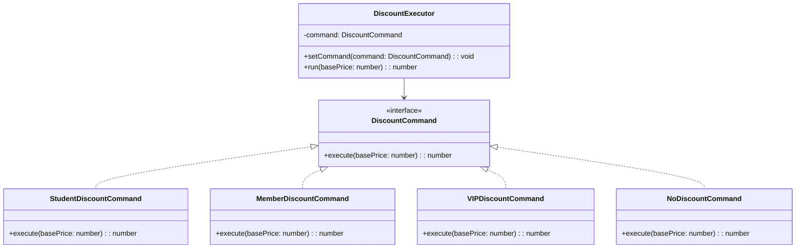

import Tabs from "@theme/Tabs";
import TabItem from "@theme/TabItem";
import CodeBlock from "@theme/CodeBlock";

import tsCode from "@site/src/codes/excessive-branching/ts/rfc_command.ts";
import phpCode from "@site/src/codes/excessive-branching/php/rfc_command.php";
import pyCode from "@site/src/codes/excessive-branching/py/rfc_command.py";

# 🧩 Command Pattern

## ✅ Intent

- Encapsulate a request as a **command object**
- Useful for recording, re-executing, or scheduling operations

## ✅ Motivation

- The processing logic is passed in from the outside → `execute()`
- Well-suited for **Undo/Redo** functionality or batch operations

## ✅ When to Use

- When **operation history matters**, such as in user actions or batch processing
- When operations need to be **deferred or accumulated**

## ✅ Code Example

<Tabs groupId="language">
  <TabItem value="ts" label="TypeScript">
    <CodeBlock language="ts">{tsCode}</CodeBlock>
  </TabItem>
  <TabItem value="php" label="PHP">
    <CodeBlock language="php">{phpCode}</CodeBlock>
  </TabItem>
  <TabItem value="python" label="Python">
    <CodeBlock language="python">{pyCode}</CodeBlock>
  </TabItem>
</Tabs>

## ✅ Explanation

This code applies the `Command` pattern to encapsulate discount logic as command objects that can be dynamically executed.  
The `Command` pattern expresses operations as objects, enabling deferred execution, queuing, or undo capabilities.

### 1. Overview of the Command Pattern

- **Command**: Defines the interface for encapsulated operations

  - Represented by `DiscountCommand` in this code

- **ConcreteCommand**: Implements the `Command` interface and provides specific logic

  - Implemented by `StudentDiscountCommand`, `MemberDiscountCommand`, `VIPDiscountCommand`, and `NoDiscountCommand`

- **Invoker**: Executes the command

  - Represented by `DiscountExecutor`

- **Client**: Creates the appropriate command and passes it to the invoker
  - Represented by the part of the code that uses a `switch` statement to generate a `DiscountCommand` and pass it to `DiscountExecutor`

### 2. Key Classes and Their Roles

- `DiscountCommand`

  - Common interface for discount operations
  - Declares the method `execute(basePrice: number): number`

- `StudentDiscountCommand`, `MemberDiscountCommand`, `VIPDiscountCommand`, `NoDiscountCommand`

  - Concrete command classes implementing `DiscountCommand`
  - Each applies a different discount rate

- `DiscountExecutor`

  - The `Invoker` class
  - Uses `setCommand` to receive a command, and `run` to execute it

- `Client`
  - Generates the appropriate command using a `switch` statement based on user type and passes it to the `DiscountExecutor`

### 3. UML Class Diagram

### 4. Benefits of the Command Pattern

- **Encapsulation of Actions**: Operations are expressed as objects, enabling deferred execution, queuing, and undo functionality
- **Flexibility**: New commands can be added simply by implementing `DiscountCommand`
- **Generic Invoker**: `DiscountExecutor` can execute any command, increasing its reusability

This design improves flexibility and extensibility by treating operations as first-class objects. It is particularly useful when dynamic switching or history management is required.
