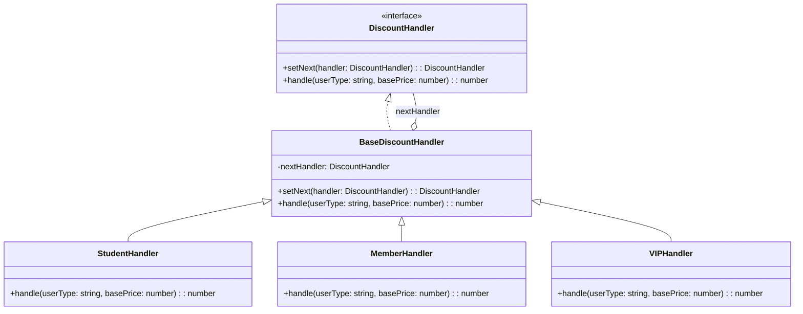

import Tabs from "@theme/Tabs";
import TabItem from "@theme/TabItem";
import CodeBlock from "@theme/CodeBlock";

import tsCode from "@site/src/codes/excessive-branching/ts/rfc_cor.ts";
import phpCode from "@site/src/codes/excessive-branching/php/rfc_cor.php";
import pyCode from "@site/src/codes/excessive-branching/py/rfc_cor.py";

# 🧩 Chain of Responsibility Pattern

## ✅ Intent

- Chain multiple handler classes together and **delegate processing based on conditions**
- Each handler either **processes the request or passes it along**

## ✅ Motivation

- Convert branching logic into a **sequential processing chain**
- Ideal for situations where the processing flow should be traced step by step

## ✅ When to Use

- When each handler is independent and **only one of them should process the request**
- When you want to **delegate to the one matching condition** among many

## ✅ Code Example

<Tabs groupId="language">
  <TabItem value="ts" label="TypeScript">
    <CodeBlock language="ts">{tsCode}</CodeBlock>
  </TabItem>
  <TabItem value="php" label="PHP">
    <CodeBlock language="php">{phpCode}</CodeBlock>
  </TabItem>
  <TabItem value="python" label="Python">
    <CodeBlock language="python">{pyCode}</CodeBlock>
  </TabItem>
</Tabs>

## ✅ Explanation

This code applies the `Chain of Responsibility (CoR)` pattern to divide discount logic into a series of handlers that process the request sequentially.  
The `CoR` pattern allows multiple objects to process a request in turn, passing it along the chain until an appropriate handler takes responsibility.

### 1. Overview of the Chain of Responsibility Pattern

- **Handler**: Defines the interface for handling requests

  - Represented by `DiscountHandler` in this code

- **ConcreteHandler**: Implements the `Handler` interface and handles specific types of requests

  - Implemented by `StudentHandler`, `MemberHandler`, and `VIPHandler`

- **Client**: Builds the chain of handlers and passes the request to the first one
  - Represented by `student.setNext(member).setNext(vip)` in this code

### 2. Key Classes and Their Roles

- `DiscountHandler`

  - Common interface for all handlers
  - `setNext(handler: DiscountHandler): DiscountHandler` sets the next handler
  - `handle(userType: string, basePrice: number): number` processes the request

- `BaseDiscountHandler`

  - Abstract class implementing `DiscountHandler`
  - Provides a default implementation of `setNext` and delegates to the next handler in `handle`

- `StudentHandler`, `MemberHandler`, `VIPHandler`

  - Concrete handler classes extending `BaseDiscountHandler`
  - Each implements specific discount logic based on user type (`student`, `member`, `vip`)

- Client Code
  - Constructs the handler chain and sends the request to the first handler

### 3. UML Class Diagram

### 4. Benefits of the Chain of Responsibility Pattern

- **Flexible Processing Flow**: The order of handlers can be changed dynamically
- **Single Responsibility Principle**: Each handler is responsible for only one kind of processing
- **Extensibility**: New handlers can be added without modifying existing code

This design enables flexible request handling and eliminates complex conditional logic. It is especially effective when processing needs to be dynamically restructured or when multiple conditional branches must be managed cleanly.
