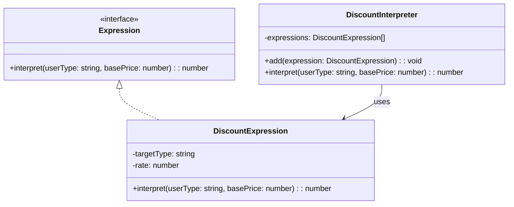

import Tabs from "@theme/Tabs";
import TabItem from "@theme/TabItem";
import CodeBlock from "@theme/CodeBlock";

import tsCode from "@site/src/codes/excessive-branching/ts/rfc_interpreter.ts";
import phpCode from "@site/src/codes/excessive-branching/php/rfc_interpreter.php";
import pyCode from "@site/src/codes/excessive-branching/py/rfc_interpreter.py";

# 🧩 Interpreter Pattern

## ✅ Intent

- Represent conditional logic or business rules as a **grammar**, and define a structure for interpreting and evaluating it
- Ideal for building **domain-specific languages (DSLs)** for rule evaluation

## ✅ Motivation

- Complex and frequently changing conditional logic can be defined as an **abstract syntax tree** and delegated to an interpreter
- Transforms deeply nested `if`/`switch` statements into a **flexible, extensible structure**

## ✅ When to Use

- Business rule engines, filter conditions, search expressions, etc.
- When rules are defined by non-engineers or via configuration files and **evaluated at runtime**

## ✅ Code Example

<Tabs groupId="language">
  <TabItem value="ts" label="TypeScript">
    <CodeBlock language="ts">{tsCode}</CodeBlock>
  </TabItem>
  <TabItem value="php" label="PHP">
    <CodeBlock language="php">{phpCode}</CodeBlock>
  </TabItem>
  <TabItem value="python" label="Python">
    <CodeBlock language="python">{pyCode}</CodeBlock>
  </TabItem>
</Tabs>

## ✅ Explanation

This code applies the `Interpreter` pattern to represent discount rules as a grammar and evaluate them flexibly.  
The `Interpreter` pattern defines a grammar for a given language and provides an interpreter to evaluate expressions written in that language. It is particularly useful for complex or dynamic rule evaluation.

### 1. Overview of the Interpreter Pattern

- **Expression**: Defines the common interface for all grammar expressions

  - Represented by `Expression` in this code

- **TerminalExpression**: Implements atomic expressions containing specific logic

  - Represented by `DiscountExpression`

- **NonTerminalExpression**: Combines multiple expressions and defines how they are evaluated

  - Represented by `DiscountInterpreter`

- **Client**: Constructs the grammar and executes the interpretation
  - In this code, the part where multiple `DiscountExpression`s are added to `DiscountInterpreter` and `interpret` is called

### 2. Key Classes and Their Roles

- `Expression`

  - Common interface for all expressions
  - Declares the method `interpret(userType: string, basePrice: number): number`

- `DiscountExpression`

  - A `TerminalExpression`
  - Applies a specific discount rate (`rate`) if the user type matches (`targetType`)

- `DiscountInterpreter`

  - A `NonTerminalExpression`
  - Holds multiple `DiscountExpression` instances and evaluates them in order
  - Returns the result of the first matching expression

- Client Code
  - Adds multiple `DiscountExpression`s to `DiscountInterpreter` and executes the evaluation using `interpret`

### 3. UML Class Diagram

### 4. Benefits of the Interpreter Pattern

- **Flexible Rule Definition**: Rules can be expressed as objects, enabling concise representation of complex conditions
- **Extensibility**: New rules can be added simply by creating a new `DiscountExpression` and adding it to the interpreter
- **Reusability**: Each expression is independent and can be reused across different contexts

This design is highly effective for managing complex or dynamic rule sets, and is especially useful in scenarios where rules may evolve or grow over time.
