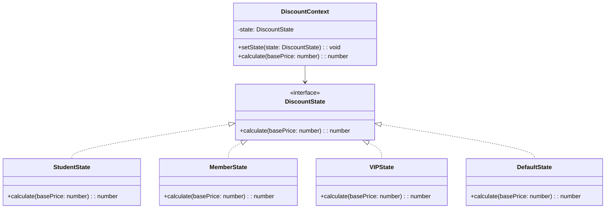

import Tabs from "@theme/Tabs";
import TabItem from "@theme/TabItem";
import CodeBlock from "@theme/CodeBlock";

import tsCode from "@site/src/codes/excessive-branching/ts/rfc_state.ts";
import phpCode from "@site/src/codes/excessive-branching/php/rfc_state.php";
import pyCode from "@site/src/codes/excessive-branching/py/rfc_state.py";

# 🧩 State Pattern

## ✅ Intent

- Change an object's behavior based on its **current state**
- Delegate state-specific responsibilities to separate classes

## ✅ Motivation

- Effective when **user types** can be treated as internal states
- Even the logic for changing state itself can be handled by the state objects

## ✅ When to Use

- When the **current state becomes the central concern**, such as user rank or login status
- When you need **controlled state transitions**

## ✅ Code Example

<Tabs groupId="language">
  <TabItem value="ts" label="TypeScript">
    <CodeBlock language="ts">{tsCode}</CodeBlock>
  </TabItem>
  <TabItem value="php" label="PHP">
    <CodeBlock language="php">{phpCode}</CodeBlock>
  </TabItem>
  <TabItem value="python" label="Python">
    <CodeBlock language="python">{pyCode}</CodeBlock>
  </TabItem>
</Tabs>

## ✅ Explanation

This code applies the `State` pattern to isolate discount logic into separate states that can be switched dynamically.  
The `State` pattern allows an object to alter its behavior based on internal state, eliminating conditional branches and improving readability and maintainability.

### 1. Overview of the State Pattern

- **State**: Defines an interface for behavior specific to each state

  - Represented here by `DiscountState`

- **ConcreteState**: Implements the `State` interface to provide specific behavior for each state

  - Implemented by `StudentState`, `MemberState`, `VIPState`, and `DefaultState` in this code

- **Context**: Holds the current state and delegates behavior based on it
  - Represented by `DiscountContext` in this code

### 2. Key Classes and Their Roles

- `DiscountState`

  - Common interface for discount calculation
  - Defines the method `calculate(basePrice: number): number`

- `StudentState`, `MemberState`, `VIPState`, `DefaultState`

  - Concrete state classes implementing `DiscountState`
  - Each applies a different discount rate

- `DiscountContext`
  - Context class that maintains the current state
  - Allows switching state via `setState`, and executes the discount calculation via the current state's `calculate` method

### 3. UML Class Diagram

### 4. Benefits of the State Pattern

- **Eliminates Conditional Branching**: By moving logic into state classes, conditionals can be eliminated
- **Extensibility**: Adding a new state requires only implementing `DiscountState`
- **Dynamic Switching**: Allows state transitions at runtime in a clean and controlled way

This design clearly separates behavior by state and provides a safe mechanism for managing transitions—especially effective in scenarios with growing conditional logic.
