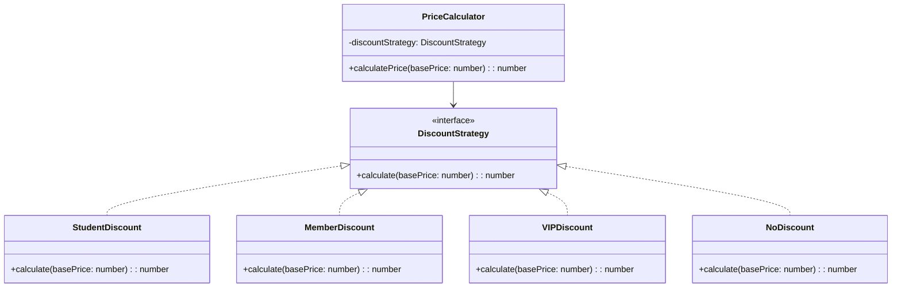

import Tabs from "@theme/Tabs";
import TabItem from "@theme/TabItem";
import CodeBlock from "@theme/CodeBlock";

import tsCode from "@site/src/codes/excessive-branching/ts/rfc_strategy.ts";
import phpCode from "@site/src/codes/excessive-branching/php/rfc_strategy.php";
import pyCode from "@site/src/codes/excessive-branching/py/rfc_strategy.py";

# 🧩 Strategy Pattern

## ✅ Intent

- Separate behavior based on conditions into individual **strategies**
- Allow the strategy to be selected externally for flexible switching

## ✅ Motivation

- Branching logic is divided **into independent objects**, making it easier to test and extend
- Ideal for systems where algorithm swapping is required

## ✅ When to Use

- When algorithms or processing logic need to be **dynamically switched**
- When behaviors can be clearly categorized, such as "Pattern A", "Pattern B", etc.

## ✅ Code Example

<Tabs groupId="language">
  <TabItem value="ts" label="TypeScript">
    <CodeBlock language="ts">{tsCode}</CodeBlock>
  </TabItem>
  <TabItem value="php" label="PHP">
    <CodeBlock language="php">{phpCode}</CodeBlock>
  </TabItem>
  <TabItem value="python" label="Python">
    <CodeBlock language="python">{pyCode}</CodeBlock>
  </TabItem>
</Tabs>

## ✅ Explanation

This code applies the `Strategy` pattern to enable flexible switching between different discount calculation logics.  
The `Strategy` pattern encapsulates algorithms or logic into separate classes, allowing them to be swapped dynamically.

### 1. Overview of the Strategy Pattern

- **Strategy**: Defines a common interface to treat different algorithms uniformly

  - Represented in this code by `DiscountStrategy`

- **ConcreteStrategy**: Implements the strategy interface and provides specific algorithms

  - Implemented by `StudentDiscount`, `MemberDiscount`, `VIPDiscount`, and `NoDiscount` in this code

- **Context**: Uses a `Strategy` and switches algorithms dynamically
  - Represented by `PriceCalculator` in this code

### 2. Key Classes and Their Roles

- `DiscountStrategy`

  - The common interface for discount calculations
  - Defines the method `calculate(basePrice: number): number`

- `StudentDiscount`, `MemberDiscount`, `VIPDiscount`, `NoDiscount`

  - Concrete strategy classes that implement `DiscountStrategy`
  - Each class applies a different discount rate

- `PriceCalculator`
  - The context class
  - Receives a `DiscountStrategy` instance via its constructor and calculates the final price using the `calculatePrice` method

### 3. UML Class Diagram

### 4. Benefits of the Strategy Pattern

- **Flexibility**: New discount logics can be added by simply implementing `DiscountStrategy`
- **Single Responsibility Principle**: Each discount logic is isolated in its own class, improving maintainability
- **Runtime Switching**: Different discount strategies can be swapped easily at runtime

This design is highly effective in cases where algorithm switching is needed and significantly improves code extensibility and maintainability.
