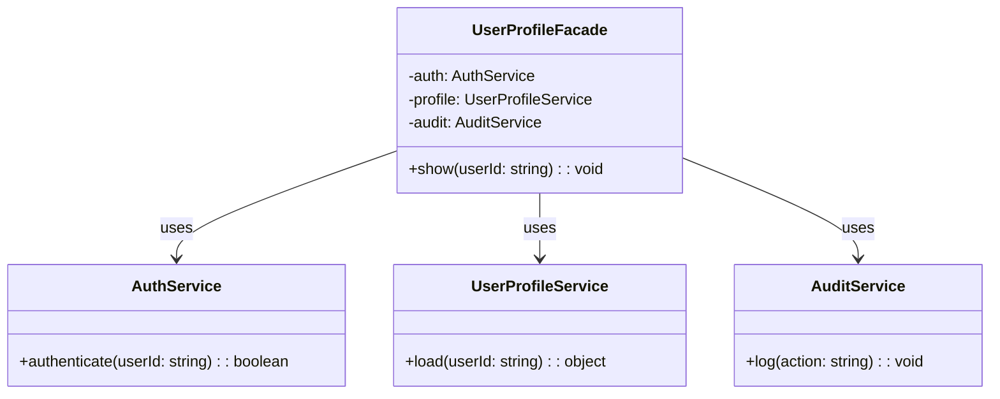

import Tabs from "@theme/Tabs";
import TabItem from "@theme/TabItem";
import CodeBlock from "@theme/CodeBlock";

import tsCode from "@site/src/codes/exposed-complexity/ts/rfc_facade.ts";
import phpCode from "@site/src/codes/exposed-complexity/php/rfc_facade.php";
import pyCode from "@site/src/codes/exposed-complexity/py/rfc_facade.py";

# 🧩 Facade Pattern

## ✅ Intent

- Provide a **simple, unified interface** to a complex subsystem
- Hide internal logic behind a clean and **task-oriented entry point**

## ✅ Motivation

- Simplify client responsibilities by exposing only what’s necessary
- Help decouple client code from subsystem changes

## ✅ When to Use

- When a task involves **multiple steps across services**
- To provide a **gateway for frameworks or module groups**
- To simplify complex workflows for reuse and clarity

## ✅ Code Example

<Tabs groupId="language">
  <TabItem value="ts" label="TypeScript">
    <CodeBlock language="ts">{tsCode}</CodeBlock>
  </TabItem>
  <TabItem value="php" label="PHP">
    <CodeBlock language="php">{phpCode}</CodeBlock>
  </TabItem>
  <TabItem value="python" label="Python">
    <CodeBlock language="python">{pyCode}</CodeBlock>
  </TabItem>
</Tabs>

## ✅ Explanation

This example applies the `Facade` pattern to unify three distinct subsystems — `AuthService`, `UserProfileService`, and `AuditService` — under a simple interface.

The `UserProfileFacade` class consolidates these into a single `show(userId)` call that handles authentication, profile retrieval, and audit logging.

### 1. Facade Pattern Overview

- **Subsystem Classes**: Provide individual pieces of logic

  - In this example: `AuthService`, `UserProfileService`, `AuditService`

- **Facade**: Simplifies access to the subsystems through a unified interface

  - Here: `UserProfileFacade`

- **Client**: Uses the facade to complete a complex task via a single call
  - Here: `facade.show("user-123")`

### 2. Key Classes and Roles

- `AuthService`

  - Authenticates the user

- `UserProfileService`

  - Fetches user profile information

- `AuditService`

  - Logs the profile access action

- `UserProfileFacade`

  - Encapsulates the entire workflow into a single `show()` method

- **Client Code**
  - Calls only `UserProfileFacade.show()` instead of dealing with each subsystem separately

### 3. UML Class Diagram

### 4. Benefits of the Facade Pattern

- **Simplified Interface**: Reduces the learning curve and usage complexity
- **Decoupling**: Hides internal subsystem logic from the client
- **Improved Maintainability**: Internal changes are absorbed by the facade, not the client

This design is especially helpful when internal complexity needs to be hidden to promote reuse and cleaner interfaces.  
It enhances both usability and maintainability by preventing business logic from leaking into calling code.
