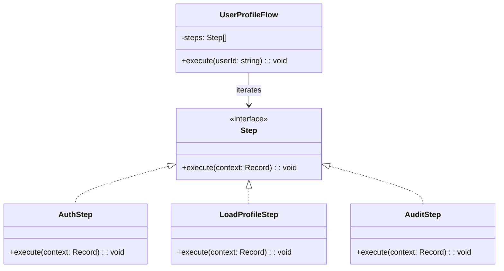

import Tabs from "@theme/Tabs";
import TabItem from "@theme/TabItem";
import CodeBlock from "@theme/CodeBlock";

import tsCode from "@site/src/codes/exposed-complexity/ts/rfc_iterator.ts";
import phpCode from "@site/src/codes/exposed-complexity/php/rfc_iterator.php";
import pyCode from "@site/src/codes/exposed-complexity/py/rfc_iterator.py";

# 🧩 Iterator Pattern

## ✅ Intent

- **Abstract the traversal of a collection** so that the iteration logic is reusable and separate from processing logic
- Focus on the **"traversal mechanism"**, not the "business logic"

## ✅ Motivation

- If your `Facade` or `Proxy` involves iteration or sequences of actions (e.g. multi-step flows), you can decouple that traversal logic using an iterator
- Replaces repeated `for` loops scattered across multiple classes

## ✅ When to Use

- You have a sequence of steps or items (auth, load, audit, etc.)
- You want to encapsulate iteration and make the flow reusable and maintainable

## ✅ Code Example

<Tabs groupId="language">
  <TabItem value="ts" label="TypeScript">
    <CodeBlock language="ts">{tsCode}</CodeBlock>
  </TabItem>
  <TabItem value="php" label="PHP">
    <CodeBlock language="php">{phpCode}</CodeBlock>
  </TabItem>
  <TabItem value="python" label="Python">
    <CodeBlock language="python">{pyCode}</CodeBlock>
  </TabItem>
</Tabs>

## ✅ Explanation

This code uses the `Iterator` pattern to define a **user flow** made of sequential processing steps like authentication, profile loading, and audit logging. Each step is independent and follows a shared interface.

This approach improves maintainability, allows future extension (new steps), and isolates control flow from implementation details.

### 1. Iterator Pattern Overview

- **Aggregate**: A collection that exposes a unified interface to iterate over its elements

  - Here: `UserProfileFlow`

- **Iterator**: Mechanism to traverse the elements of the collection

  - Here: `for...of` loop over the `steps` list

- **Concrete Element**: The individual elements of the collection
  - Here: `AuthStep`, `LoadProfileStep`, `AuditStep`

### 2. Key Classes and Responsibilities

- `Step`

  - Common interface for all steps with an `execute(context: object)` method

- `AuthStep`, `LoadProfileStep`, `AuditStep`

  - Concrete implementations of `Step`, each encapsulating a part of the logic:
    - `AuthStep`: Verifies authentication
    - `LoadProfileStep`: Loads user profile
    - `AuditStep`: Logs the access

- `UserProfileFlow`
  - Aggregates all steps
  - `execute()` method traverses each step and applies it sequentially

### 3. UML Class Diagram

### 4. Benefits of the Iterator Pattern

- **Clear control flow**: Easy to understand and maintain ordered execution of steps
- **Extensible**: New steps can be added without modifying the flow logic
- **Reusability**: Common iteration logic is centralized and separated from business rules

This design is particularly effective when working with flows or pipelines composed of multiple discrete stages. It keeps logic modular and enables consistent iteration across different contexts.
