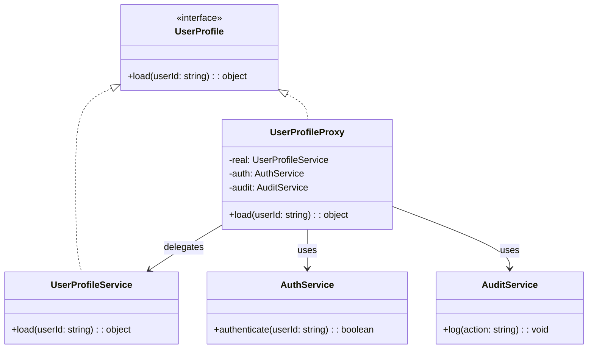

import Tabs from "@theme/Tabs";
import TabItem from "@theme/TabItem";
import CodeBlock from "@theme/CodeBlock";

import tsCode from "@site/src/codes/exposed-complexity/ts/rfc_proxy.ts";
import phpCode from "@site/src/codes/exposed-complexity/php/rfc_proxy.php";
import pyCode from "@site/src/codes/exposed-complexity/py/rfc_proxy.py";

# 🧩 Proxy Pattern

## ✅ Intent

- Introduce a **surrogate or placeholder** to control access to a real object
- The proxy **implements the same interface** as the original and adds behavior such as **authorization, logging, caching, or lazy loading**

## ✅ Motivation

- Control access or precondition checks before delegating to the actual service
- Add cross-cutting concerns without changing the original implementation

## ✅ When to Use

- You need to **add authentication, caching, logging**, etc. around a service
- You want to **delay resource-heavy initialization**
- You want to **wrap external services** for uniform access

## ✅ Code Example

<Tabs groupId="language">
  <TabItem value="ts" label="TypeScript">
    <CodeBlock language="ts">{tsCode}</CodeBlock>
  </TabItem>
  <TabItem value="php" label="PHP">
    <CodeBlock language="php">{phpCode}</CodeBlock>
  </TabItem>
  <TabItem value="python" label="Python">
    <CodeBlock language="python">{pyCode}</CodeBlock>
  </TabItem>
</Tabs>

## ✅ Explanation

This code applies the `Proxy` pattern to wrap access to the `UserProfileService` behind a `UserProfileProxy`, adding authentication and audit logging.

This allows the client to interact with a simplified and safe interface, while the proxy takes care of verifying access and tracking actions.

### 1. Proxy Pattern Overview

- **Subject**: Common interface used by both the real service and the proxy

  - Here: `UserProfile`

- **RealSubject**: The actual object that performs the operation

  - Here: `UserProfileService`

- **Proxy**: Controls access to the `RealSubject`

  - Here: `UserProfileProxy`

- **Client**: Uses the `Subject` without needing to know whether it’s the real object or a proxy
  - Here: `proxy.load("user-123")`

### 2. Key Classes and Responsibilities

- `UserProfile`

  - Common interface with a `load(userId: string): object` method

- `UserProfileService`

  - Implements actual logic to retrieve user profile data

- `UserProfileProxy`

  - Checks authorization, calls the real service, and logs the operation

- `AuthService`

  - Performs authentication checks

- `AuditService`
  - Logs access attempts

### 3. UML Class Diagram

### 4. Benefits of the Proxy Pattern

- **Access Control**: Prevent unauthorized access to the real object
- **Transparent Interception**: Add logging, validation, or monitoring without changing client code
- **Clean Separation**: Keeps real logic separate from operational concerns

This design is ideal when you need to intercept access to sensitive or complex components, and want to keep client code clean and decoupled from infrastructure or policy.
