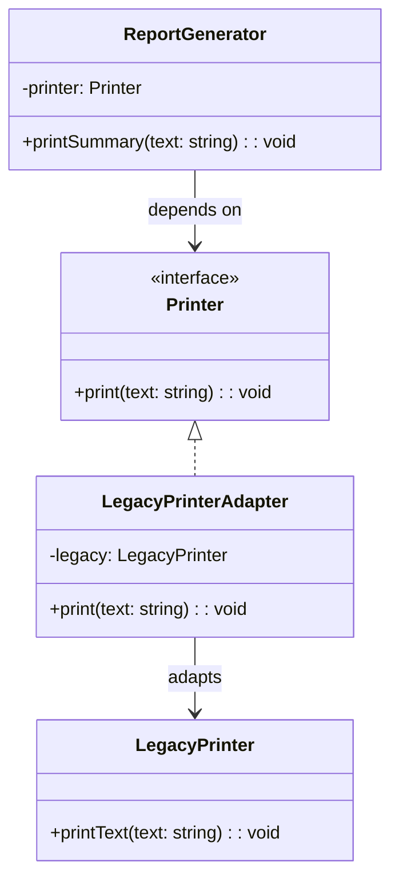

import Tabs from "@theme/Tabs";
import TabItem from "@theme/TabItem";
import CodeBlock from "@theme/CodeBlock";

import tsCode from "@site/src/codes/forced-compatibility/ts/rfc_adapter.ts";
import phpCode from "@site/src/codes/forced-compatibility/php/rfc_adapter.php";
import pyCode from "@site/src/codes/forced-compatibility/py/rfc_adapter.py";

# 🧩 Adapter Pattern

## ✅ Intent

- Create a **bridge** between an expected interface and an existing implementation when they do not match
- Introduce a **conversion layer (Adapter)** to decouple the caller from the incompatible implementation

## ✅ Motivation

- Avoid tight coupling with legacy APIs by **exposing a unified interface** to the caller
- Make it easy to swap in other implementations (e.g., mocks, alternative APIs) in the future

## ✅ When to Use

- When integrating with external services that expose incompatible APIs
- When maintaining a consistent internal interface across your codebase
- When testing or replacing dependencies with mocks is important

## ✅ Code Example

<Tabs groupId="language">
  <TabItem value="ts" label="TypeScript">
    <CodeBlock language="ts">{tsCode}</CodeBlock>
  </TabItem>
  <TabItem value="php" label="PHP">
    <CodeBlock language="php">{phpCode}</CodeBlock>
  </TabItem>
  <TabItem value="python" label="Python">
    <CodeBlock language="python">{pyCode}</CodeBlock>
  </TabItem>
</Tabs>

## ✅ Explanation

This code uses the `Adapter` pattern to connect two incompatible interfaces:  
a legacy implementation (`LegacyPrinter`) and a new expected interface (`Printer`).  
The `ReportGenerator` uses only the new interface and doesn't need to know the details of the legacy class.  
The `Adapter` pattern allows reusing legacy classes without modification by adapting them to a new interface.

### 1. Overview of the Adapter Pattern

- **Target**: The interface expected by the client

  - Represented by `Printer`

- **Adaptee**: The existing class with an incompatible interface

  - Represented by `LegacyPrinter`

- **Adapter**: Wraps the `Adaptee` and implements the `Target` interface

  - Represented by `LegacyPrinterAdapter`

- **Client**: Relies on the `Target` interface
  - Represented by `ReportGenerator`

### 2. Key Classes and Their Roles

- `LegacyPrinter`

  - The existing legacy class (`Adaptee`)
  - Provides a `printText` method

- `Printer`

  - The new interface (`Target`)
  - Defines a `print` method

- `LegacyPrinterAdapter`

  - Implements the `Printer` interface and wraps a `LegacyPrinter` instance
  - Translates method calls as needed (e.g., converting text to uppercase)

- `ReportGenerator`
  - The client class
  - Depends only on the `Printer` interface
  - Uses `printSummary` to generate and print output

### 3. UML Class Diagram

### 4. Benefits of the Adapter Pattern

- **Provides Compatibility**: Adapts existing classes to new interfaces without modifying their code
- **Improves Reusability**: Legacy classes can be reused in new code
- **Reduces Coupling**: Clients depend only on the new interface, not the legacy implementation

This design is especially useful when integrating legacy systems into modern applications,  
enhancing flexibility and maintainability without invasive changes to existing code.
