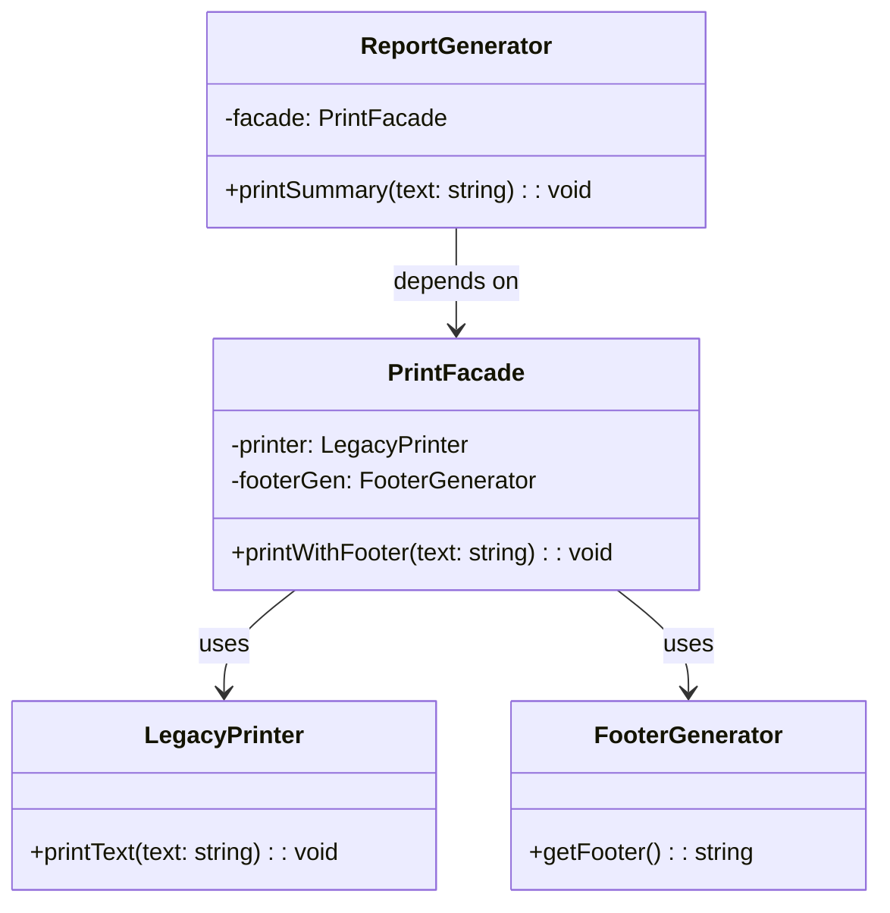

import Tabs from "@theme/Tabs";
import TabItem from "@theme/TabItem";
import CodeBlock from "@theme/CodeBlock";

import tsCode from "@site/src/codes/forced-compatibility/ts/rfc_facade.ts";
import phpCode from "@site/src/codes/forced-compatibility/php/rfc_facade.php";
import pyCode from "@site/src/codes/forced-compatibility/py/rfc_facade.py";

# 🧩 Facade Pattern

## ✅ Intent

- **Simplify access to complex subsystems or multiple operations** by providing a single, unified interface
- Hide implementation details and workflow from the client, enabling **simplified and safe usage**
- Introduce a **facade** as a clean entry point to reduce coupling between caller and implementation

## ✅ Motivation

- You want to **wrap multiple lower-level modules or legacy APIs** into a single access point
- Client code contains **scattered logic** for initialization, formatting, or side effects
- You want to refactor toward a **maintainable and change-resilient structure**
- Provide a clean API to UIs or service layers **without exposing internal complexity**

## ✅ When to Use

- You want to **wrap complex low-level operations** (e.g., API calls, config, logging, notifications) into a single method
- You are dealing with **multiple external services or legacy APIs** and want to present a unified interface
- You need to abstract an entire process to **support testing or mocking**
- You want the caller's code to be **as simple and safe as possible**
- You require **controlled, fail-safe orchestration** of multi-step processes (e.g., service integration)

## ✅ Code Example

<Tabs groupId="language">
  <TabItem value="ts" label="TypeScript">
    <CodeBlock language="ts">{tsCode}</CodeBlock>
  </TabItem>
  <TabItem value="php" label="PHP">
    <CodeBlock language="php">{phpCode}</CodeBlock>
  </TabItem>
  <TabItem value="python" label="Python">
    <CodeBlock language="python">{pyCode}</CodeBlock>
  </TabItem>
</Tabs>

## ✅ Explanation

This code uses the `Facade` pattern to hide complex internal logic—such as the legacy printer and footer generation—and expose a simplified interface through `PrintFacade`.  
The `Facade` pattern provides a unified interface to a set of subsystems, enabling clients to interact with them more easily and safely.

### 1. Overview of the Facade Pattern

- **Subsystem Classes**: Provide complex or low-level functionality

  - Represented by `LegacyPrinter` and `FooterGenerator`

- **Facade**: Provides a simplified interface for using multiple subsystems together

  - Represented by `PrintFacade`

- **Client**: Uses the facade without needing to understand the underlying subsystems
  - Represented by `ReportGenerator`

### 2. Key Classes and Their Roles

- `LegacyPrinter`

  - Part of the subsystem
  - Provides low-level text printing functionality

- `FooterGenerator`

  - Part of the subsystem
  - Generates footer text to append to documents

- `PrintFacade`

  - The facade class
  - Orchestrates the subsystems and provides a simple method: `printWithFooter`

- `ReportGenerator`
  - The client class
  - Uses the `PrintFacade` to print a report with a footer without knowing internal details

### 3. UML Class Diagram

### 4. Benefits of the Facade Pattern

- **Simplified interface**: Clients can interact with complex systems through a minimal set of methods
- **Reduced coupling**: Client code is decoupled from the underlying implementation
- **Improved maintainability**: Changes to the subsystems are isolated inside the `Facade`, reducing impact on client code

This design is especially useful when dealing with complex or fragile internal processes that must be abstracted away from external code.  
It improves clarity, safety, and testability across the application.
