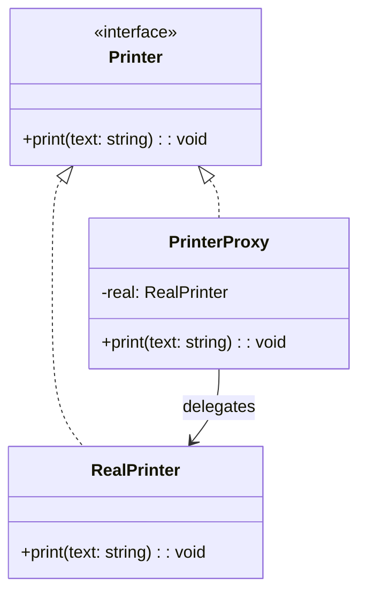

import Tabs from "@theme/Tabs";
import TabItem from "@theme/TabItem";
import CodeBlock from "@theme/CodeBlock";

import tsCode from "@site/src/codes/forced-compatibility/ts/rfc_proxy.ts";
import phpCode from "@site/src/codes/forced-compatibility/php/rfc_proxy.php";
import pyCode from "@site/src/codes/forced-compatibility/py/rfc_proxy.py";

# 🧩 Proxy Pattern

## ✅ Intent

- **Indirectly access a real object (Real Subject)** by introducing a **proxy** that performs control, checks, or lazy loading
- The client accesses the proxy instead of the real object, enabling a **transparent layer of control or enhancement**
- **Use cases include access control, caching, logging, lazy loading, and remote calls**

## ✅ Motivation

- You want to **delay instantiation** of a heavy object (e.g., remote service, image loader, large dataset)
- You need a **unified way to enforce access control, logging, or pre-processing**
- You want to **wrap the real subject without modifying it**, following the Open/Closed Principle
- You want to **insert a control layer** between the client and the real subject

## ✅ When to Use

- You need **lazy initialization** of heavyweight objects
- You want to **add pre/post-processing** around real object access
- You want to **hide or abstract away remote boundaries** (e.g., RPC, REST API)
- You need **transparent logging, monitoring, or caching layers**
- You want to **mock or replace the real object for testing purposes**

## ✅ Code Example

<Tabs groupId="language">
  <TabItem value="ts" label="TypeScript">
    <CodeBlock language="ts">{tsCode}</CodeBlock>
  </TabItem>
  <TabItem value="php" label="PHP">
    <CodeBlock language="php">{phpCode}</CodeBlock>
  </TabItem>
  <TabItem value="python" label="Python">
    <CodeBlock language="python">{pyCode}</CodeBlock>
  </TabItem>
</Tabs>

## ✅ Explanation

This code demonstrates the `Proxy` pattern, where a `PrinterProxy` mediates access to the `RealPrinter`.  
The `Proxy` pattern provides a placeholder object to control access to another object.  
It is commonly used for lazy initialization, logging, caching, or access control.

### 1. Overview of the Proxy Pattern

- **Subject**: Common interface used by the client

  - Represented by `Printer`

- **RealSubject**: The actual object that performs the core functionality

  - Represented by `RealPrinter`

- **Proxy**: Controls access to the `RealSubject` and optionally enhances behavior

  - Represented by `PrinterProxy`

- **Client**: Uses the `Subject` interface without knowing whether it's dealing with the proxy or real object
  - For example, calling `printer.print("Monthly Report")`

### 2. Key Classes and Their Roles

- `Printer`

  - The common interface (`Subject`)
  - Defines `print(text: string): void`

- `RealPrinter`

  - The actual implementation (`RealSubject`)
  - Implements the `print` method with the real logic

- `PrinterProxy`

  - The proxy implementation
  - Wraps the `RealPrinter` and controls access
  - Adds logging before and after calling `print`

- Client Code
  - Interacts with `PrinterProxy` which delegates to `RealPrinter`

### 3. UML Class Diagram

### 4. Benefits of the Proxy Pattern

- **Access Control**: Prevents direct access to the real object, adding a layer of control
- **Enhancement**: Easily adds cross-cutting concerns like logging, caching, or validation
- **Lazy Initialization**: Defers creation of the real object until it's needed, saving resources

This pattern is especially useful when you need to intercept or augment access to a real object without modifying it.  
It promotes clean layering and improves flexibility, testability, and maintainability.
