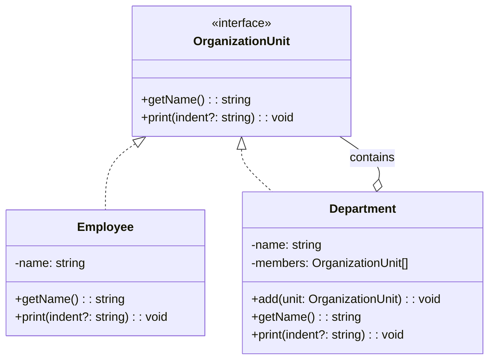

import Tabs from "@theme/Tabs";
import TabItem from "@theme/TabItem";
import CodeBlock from "@theme/CodeBlock";

import tsCode from "@site/src/codes/god-object/ts/rfc_composite.ts";
import phpCode from "@site/src/codes/god-object/php/rfc_composite.php";
import pyCode from "@site/src/codes/god-object/py/rfc_composite.py";

# 🧩 Composite Pattern

## ✅ Intent

- Represent objects in a **tree structure** so that individual objects and groups can be **treated uniformly**
- Useful when a large `God Object` contains **recursive substructures**

## ✅ Motivation

- When a `God Object` contains **recursive structures** such as UI layouts, document hierarchies, or organizational charts
- Enables easy reuse, addition, and removal of components

## ✅ When to Use

- For classes that handle **hierarchical structures** such as folder trees, menu hierarchies, or GUI components
- When organizing data structures that recursively contain child elements

## ✅ Code Example

<Tabs groupId="language">
  <TabItem value="ts" label="TypeScript">
    <CodeBlock language="ts">{tsCode}</CodeBlock>
  </TabItem>
  <TabItem value="php" label="PHP">
    <CodeBlock language="php">{phpCode}</CodeBlock>
  </TabItem>
  <TabItem value="python" label="Python">
    <CodeBlock language="python">{pyCode}</CodeBlock>
  </TabItem>
</Tabs>

## ✅ Explanation

This code applies the `Composite` pattern to provide a unified way to handle hierarchical data structures such as an organizational chart.  
The `Composite` pattern enables individual objects and composite groups to be treated in the same way, making it ideal for managing tree structures.

- **Overview of the Composite Pattern**
  - **Component**: Defines a common interface to treat both individual and composite objects uniformly
    - In this code, represented by `OrganizationUnit`
  - **Leaf**: Represents the end nodes in the tree structure
    - Here, represented by `Employee`
  - **Composite**: Represents a group that can contain child elements
    - Here, represented by `Department`

### 2. Key Classes and Their Roles

- `OrganizationUnit`

  - The common interface
  - Defines the `getName` and `print` methods used by both `Employee` and `Department`

- `Employee`

  - Represents the `Leaf` node
  - Models an individual employee with a name and implements the `print` method to output its own name

- `Department`
  - Represents the `Composite` node
  - Manages a department name and a list of members (`OrganizationUnit`)
  - Provides an `add` method to add child units, and a `print` method to recursively output itself and its children

### 3. UML Class Diagram

### 4. Benefits of the Composite Pattern

- **Uniform Operations**: Both `Employee` and `Department` can be treated the same via the `OrganizationUnit` interface
- **Recursive Structure**: Allows for the simple representation of deeply nested hierarchies, such as departments within departments
- **Extensibility**: New element types can be added by implementing the `OrganizationUnit` interface

This design is highly effective when working with hierarchical data structures, and is well-suited for implementations such as organization charts or file systems.
