import Tabs from "@theme/Tabs";
import TabItem from "@theme/TabItem";
import CodeBlock from "@theme/CodeBlock";

import tsCode from "@site/src/codes/god-object/ts/rfc_facade.ts";
import phpCode from "@site/src/codes/god-object/php/rfc_facade.php";
import pyCode from "@site/src/codes/god-object/py/rfc_facade.py";

# 🧩 Facade Pattern

## ✅ Intent

- Hide complex internal processes and provide a **simple interface** to external callers
- Serve as a user-friendly "single entry point" to the system

## ✅ Motivation

- Allows use cases (e.g., order processing) to be invoked via a single external interface
- **Keeps responsibilities separated** while providing a unified point of access

## ✅ When to Use

- When business logic is **modularized but should be accessed as a whole**
- When you want to encapsulate a **set of related operations** into a single function call

## ✅ Code Example

<Tabs groupId="language">
  <TabItem value="ts" label="TypeScript">
    <CodeBlock language="ts">{tsCode}</CodeBlock>
  </TabItem>
  <TabItem value="php" label="PHP">
    <CodeBlock language="php">{phpCode}</CodeBlock>
  </TabItem>
  <TabItem value="python" label="Python">
    <CodeBlock language="python">{pyCode}</CodeBlock>
  </TabItem>
</Tabs>

## ✅ Explanation

This code applies the `Facade` pattern to hide the complex internal logic involved in order processing, exposing a simplified interface (`OrderProcessor`) to external callers.  
The `Facade` pattern provides a "gateway" to a complex subsystem, allowing clients to interact with it in a streamlined manner.

### 1. Overview of the Facade Pattern

In this implementation, the `OrderProcessor` class acts as the `Facade`, coordinating multiple classes with distinct responsibilities:

- `DiscountCalculator`: Responsible for calculating discounts
- `InventoryService`: Responsible for inventory control
- `EmailService`: Responsible for sending emails
- `OrderLogger`: Responsible for logging order activities

### 2. Key Classes and Their Roles

- `DiscountCalculator`

  - A utility class that calculates discounts
  - Computes the price based on the discount type (`student`, `member`, `default`)

- `InventoryService`

  - Handles the reduction of inventory stock

- `EmailService`

  - Sends messages to a specified email address

- `OrderLogger`

  - Records order logs

- `OrderProcessor`
  - The `Facade` class
  - Integrates the above subsystems and provides a simplified interface for order processing
  - The `confirmOrder` method performs the following steps:
    - Calculates the base price
    - Applies discounts to compute the total amount
    - Updates the inventory
    - Sends a confirmation email
    - Logs the order

### 3. UML Class Diagram

```mermaid
classDiagram
    class DiscountCalculator {
        +calculate(base: number, type: string): number
    }

    class InventoryService {
        +reduce(productIds: string[]): void
    }

    class EmailService {
        +send(email: string, message: string): void
    }

    class OrderLogger {
        +log(orderId: string): void
    }

    class OrderProcessor {
        -productIds: string[]
        -userEmail: string
        -discountType: string
        +confirmOrder(): void
    }

    OrderProcessor --> DiscountCalculator : 使用
    OrderProcessor --> InventoryService : 使用
    OrderProcessor --> EmailService : 使用
    OrderProcessor --> OrderLogger : 使用
```

### 4. Benefits of the Facade Pattern

- **Simplified Interface**: External clients can complete the entire order process by interacting only with `OrderProcessor`
- **Separation of Concerns**: Each class has a single, well-defined responsibility, improving maintainability
- **Reusability**: The underlying subsystems (`DiscountCalculator`, etc.) are decoupled and can be reused independently

This design effectively encapsulates complexity while maintaining clear separation of responsibilities among classes.
