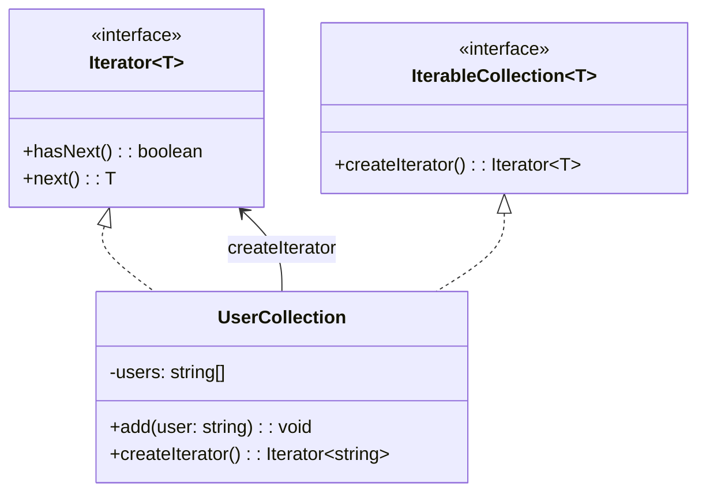

import Tabs from "@theme/Tabs";
import TabItem from "@theme/TabItem";
import CodeBlock from "@theme/CodeBlock";

import tsCode from "@site/src/codes/god-object/ts/rfc_iterator.ts";
import phpCode from "@site/src/codes/god-object/php/rfc_iterator.php";
import pyCode from "@site/src/codes/god-object/py/rfc_iterator.py";

# 🧩 Iterator Pattern

## ✅ Intent

- Provide a way to **access elements of a collection sequentially** without exposing its underlying structure
- Useful when a `God Object` contains a complex data structure with **hardcoded loop logic**

## ✅ Motivation

- To offer a **consistent way to traverse** internal data structures (lists, trees, etc.)
- Allows elements to be handled safely and concisely from the outside

## ✅ When to Use

- When looping over custom data structures is required
- When `for` or `while` loops are scattered and duplicated, and **traversal logic lacks consistency**

## ✅ Code Example

<Tabs groupId="language">
  <TabItem value="ts" label="TypeScript">
    <CodeBlock language="ts">{tsCode}</CodeBlock>
  </TabItem>
  <TabItem value="php" label="PHP">
    <CodeBlock language="php">{phpCode}</CodeBlock>
  </TabItem>
  <TabItem value="python" label="Python">
    <CodeBlock language="python">{pyCode}</CodeBlock>
  </TabItem>
</Tabs>

## ✅ Explanation

This code applies the `Iterator` pattern to provide a way to access elements within a collection (`UserCollection`) in sequence.  
The `Iterator` pattern allows elements of a collection to be accessed one at a time, while hiding the internal structure of the collection.

### 1. Overview of the Iterator Pattern

- **Iterator**: Defines an interface for accessing elements sequentially

  - In this code, represented by `Iterator<T>`

- **IterableCollection**: Defines an interface for creating iterators

  - In this code, represented by `IterableCollection<T>`

- **ConcreteCollection**: Implements the collection and provides a concrete iterator
  - In this code, represented by `UserCollection`

### 2. Key Classes and Their Roles

- `Iterator<T>`

  - The interface for iterators
  - `hasNext` checks for the existence of the next element
  - `next` retrieves the next element

- `IterableCollection<T>`

  - Interface for collections that can produce iterators
  - Declares the `createIterator` method

- `UserCollection`
  - A concrete collection class
  - Maintains an internal list of usernames (`string`)
  - Provides an `add` method to insert elements
  - Implements the `createIterator` method to return an iterator

### 3. UML Class Diagram

### 4. Benefits of the Iterator Pattern

- **Encapsulation of Internal Structure**: Allows access to elements without revealing the internal organization of the collection
- **Consistent Operations**: Enables uniform access to different types of collections through a common interface
- **Extensibility**: New collections can be added by implementing `Iterator` and `IterableCollection`

This design enables safe and consistent traversal of collection elements without needing to understand the internal structure—especially useful when dealing with complex data models.
