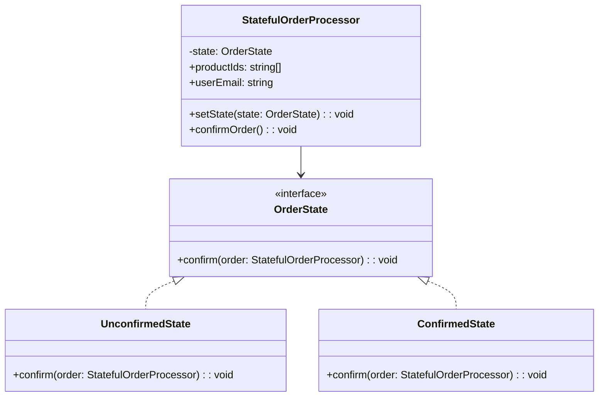

import Tabs from "@theme/Tabs";
import TabItem from "@theme/TabItem";
import CodeBlock from "@theme/CodeBlock";

import tsCode from "@site/src/codes/god-object/ts/rfc_state.ts";
import phpCode from "@site/src/codes/god-object/php/rfc_state.php";
import pyCode from "@site/src/codes/god-object/py/rfc_state.py";

# 🧩 State Pattern

## ✅ Intent

- Change behavior based on the **order status (unconfirmed / confirmed)** or processing mode
- Delegate behavior to **state-specific objects**, each representing a distinct state

## ✅ Motivation

- The `OrderManager` was responsible for switching behavior based on state
- Makes state transitions more **explicit and safe**

## ✅ When to Use

- Step-based processes (e.g., wizard-style workflows)
- Logic that varies based on the current state

## ✅ Code Example

<Tabs groupId="language">
  <TabItem value="ts" label="TypeScript">
    <CodeBlock language="ts">{tsCode}</CodeBlock>
  </TabItem>
  <TabItem value="php" label="PHP">
    <CodeBlock language="php">{phpCode}</CodeBlock>
  </TabItem>
  <TabItem value="python" label="Python">
    <CodeBlock language="python">{pyCode}</CodeBlock>
  </TabItem>
</Tabs>

## ✅ Explanation

This code applies the `State` pattern to switch behavior based on the current order status (unconfirmed or confirmed).  
The `State` pattern encapsulates state-dependent behavior within separate classes, allowing the system to transition between states in a controlled manner.

### 1. Overview of the State Pattern

- The following state classes are implemented based on the `OrderState` interface:
  - `UnconfirmedState`: Represents an order that has not yet been confirmed
  - `ConfirmedState`: Represents an already confirmed order

### 2. Key Classes and Their Roles

- `OrderState` interface

  - Defines the interface for state-specific behavior
  - Requires implementation of the `confirm(order: StatefulOrderProcessor): void` method

- `UnconfirmedState`

  - Represents the unconfirmed state of an order
  - The `confirm` method performs the following:
    - Reduces inventory
    - Sends a confirmation email to the user
    - Logs the order
    - Transitions the state to `ConfirmedState`

- `ConfirmedState`

  - Represents a confirmed order
  - The `confirm` method outputs a message indicating the order is already confirmed

- `StatefulOrderProcessor`
  - Context class that manages the current state
  - Holds the current state and delegates the `confirmOrder` method to the active state
  - State transitions are handled via the `setState` method

### 3. UML Class Diagram

### 4. Benefits of the State Pattern

- **Behavior is clearly separated by state**: Each state's logic is self-contained, improving readability and maintainability
- **Explicit state transitions**: Changes in state are clearly controlled through the `setState` method
- **Extensibility**: New states can be added by implementing the `OrderState` interface

This design clearly separates state-dependent behavior and ensures safe and manageable state transitions.
