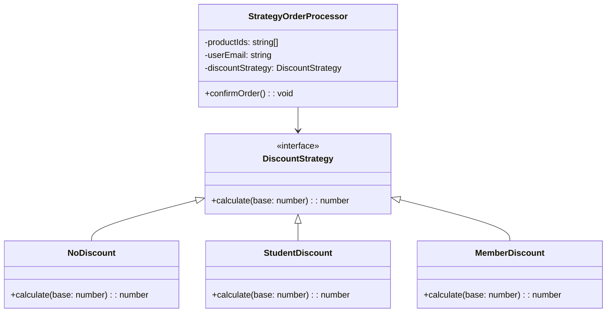

import Tabs from "@theme/Tabs";
import TabItem from "@theme/TabItem";
import CodeBlock from "@theme/CodeBlock";

import tsCode from "@site/src/codes/god-object/ts/rfc_strategy.ts";
import phpCode from "@site/src/codes/god-object/php/rfc_strategy.php";
import pyCode from "@site/src/codes/god-object/py/rfc_strategy.py";

# 🧩 Strategy Pattern

## ✅ Intent

- Extract behavior that varies within a responsibility (in this case, discount calculation) into a **separate `Strategy`**
- Inject discount rules (strategies) from the outside to **allow flexible switching**

## ✅ Motivation

- The discount logic may need to support additional rules in the future
- Encapsulating discount rules as individual classes improves testability and reusability

## ✅ When to Use

- When logic needs to be frequently selected or switched at runtime
- When conditional branches tend to grow and become hard to manage

## ✅ Code Example

<Tabs groupId="language">
  <TabItem value="ts" label="TypeScript">
    <CodeBlock language="ts">{tsCode}</CodeBlock>
  </TabItem>
  <TabItem value="php" label="PHP">
    <CodeBlock language="php">{phpCode}</CodeBlock>
  </TabItem>
  <TabItem value="python" label="Python">
    <CodeBlock language="python">{pyCode}</CodeBlock>
  </TabItem>
</Tabs>

## ✅ Explanation

This code implements an order processing system that applies different discount strategies using the `Strategy` pattern.  
The `Strategy` pattern enables algorithms or behaviors to be encapsulated as separate classes and dynamically switched at runtime.

### 1. Overview of the Strategy Pattern

- The discount logic is decoupled using the `DiscountStrategy` interface and its implementations (`NoDiscount`, `StudentDiscount`, `MemberDiscount`)
- The `StrategyOrderProcessor` class accepts a discount strategy through dependency injection, allowing it to flexibly apply different discount rules

### 2. Key Classes and Their Roles

- `DiscountStrategy` interface

  - Defines a common interface for discount calculations
  - Requires implementation of the `calculate(base: number): number` method

- `NoDiscount`, `StudentDiscount`, `MemberDiscount`

  - Concrete strategy classes that implement `DiscountStrategy`
  - Each provides a different discount logic

- `StrategyOrderProcessor`

  - Handles order processing
  - Receives a `DiscountStrategy` instance through its constructor and confirms the order using the `confirmOrder` method
  - Performs the following steps when confirming an order:
    - Calculates the base price (`productIds.length * 1000`)
    - Calculates the total price after applying the discount
    - Reduces inventory (`InventoryService.reduce`)
    - Sends a confirmation email (`EmailService.send`)
    - Logs the order (`OrderLogger.log`)

- Usage Example
  - A `StudentDiscount` instance is injected into `StrategyOrderProcessor` to process an order with a student discount

### 3. UML Class Diagram

### 4. Possible Improvements

- **Improved Testability**: Injecting `InventoryService`, `EmailService`, and `OrderLogger` as dependencies allows for easier mocking during unit tests
- **Error Handling**: Adding error handling for inventory shortages or email sending failures would make the design more robust
