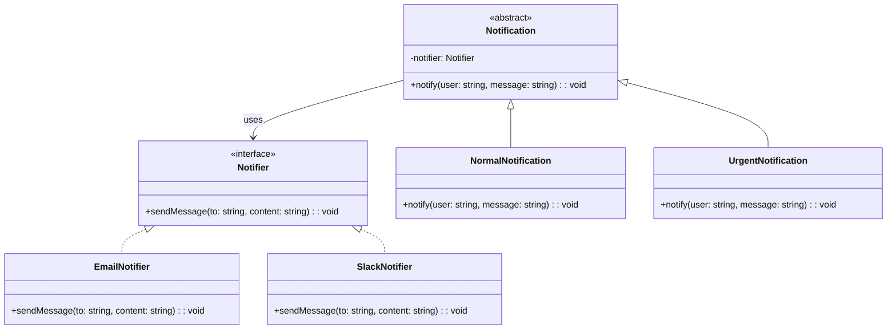

import Tabs from "@theme/Tabs";
import TabItem from "@theme/TabItem";
import CodeBlock from "@theme/CodeBlock";

import tsCode from "@site/src/codes/hardcoded-variability/ts/rfc_bridge.ts";
import phpCode from "@site/src/codes/hardcoded-variability/php/rfc_bridge.php";
import pyCode from "@site/src/codes/hardcoded-variability/py/rfc_bridge.py";

# 🧩 Bridge Pattern

## ✅ Intent

- **Decouple abstraction from implementation** so they can vary independently
- Enables the composition of independent dimensions (e.g., notification type × delivery method)

## ✅ Motivation

- You want to vary **what** is being done (e.g., normal vs urgent notification) separately from **how** it’s done (e.g., Email vs Slack)
- Avoid class explosion like `UrgentEmailNotification`, `NormalEmailNotification`, `UrgentSlackNotification`, etc.

## ✅ When to Use

- When you have two or more independent dimensions of variability
- When you want to extend abstraction and implementation hierarchies separately

## ✅ Code Example

<Tabs groupId="language">
  <TabItem value="ts" label="TypeScript">
    <CodeBlock language="ts">{tsCode}</CodeBlock>
  </TabItem>
  <TabItem value="php" label="PHP">
    <CodeBlock language="php">{phpCode}</CodeBlock>
  </TabItem>
  <TabItem value="python" label="Python">
    <CodeBlock language="python">{pyCode}</CodeBlock>
  </TabItem>
</Tabs>

## ✅ Explanation

This code uses the `Bridge` pattern to separate **how notifications are sent** (`Notifier`) from **how they're formatted or triggered** (`Notification`).

This allows you to mix and match behavior without creating deeply nested inheritance hierarchies.

### 1. Bridge Pattern Overview

- **Abstraction**: Defines the abstract logic and holds a reference to the implementation  
  → `Notification`

- **RefinedAbstraction**: Subclasses of the abstraction with specific behavior  
  → `NormalNotification`, `UrgentNotification`

- **Implementor**: Interface for platform-specific logic  
  → `Notifier`

- **ConcreteImplementor**: Concrete implementations of delivery mechanisms  
  → `EmailNotifier`, `SlackNotifier`

### 2. Key Classes and Responsibilities

- `Notifier`

  - Defines how to send messages (`sendMessage(to, content)`)

- `EmailNotifier`, `SlackNotifier`

  - Send messages through different platforms

- `Notification`

  - Defines the notification logic and delegates sending to `Notifier`

- `NormalNotification`, `UrgentNotification`
  - Customize message formats or urgency levels

### 3. UML Class Diagram

### 4. Benefits of the Bridge Pattern

- **Independent evolution**: Add new delivery mechanisms or notification formats independently
- **Avoid class explosion**: No need for one class per combination
- **Improved flexibility**: Behavior can be composed at runtime

This design is particularly useful when you're dealing with multiple variations that shouldn't be hardcoded. The bridge enables modular design and better separation of concerns.
