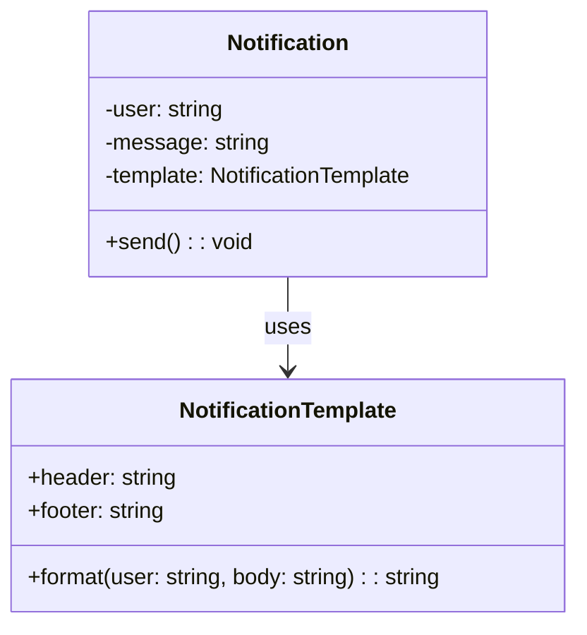

import Tabs from "@theme/Tabs";
import TabItem from "@theme/TabItem";
import CodeBlock from "@theme/CodeBlock";

import tsCode from "@site/src/codes/hardcoded-variability/ts/rfc_flyweight.ts";
import phpCode from "@site/src/codes/hardcoded-variability/php/rfc_flyweight.php";
import pyCode from "@site/src/codes/hardcoded-variability/py/rfc_flyweight.py";

# 🧩 Flyweight Pattern

## ✅ Intent

- Share objects that contain **invariant, common data** to reduce memory usage
- Extract and externalize **varying data (context)** while keeping shared logic centralized

## ✅ Motivation

- Avoid creating numerous nearly identical objects when **only a few fields vary**
- Consolidate templates, formatting rules, or behavior that is reused across many instances

## ✅ When to Use

- You need to manage **a large number of similar objects**
- Only part of each object’s state differs (e.g., label text, position, user ID)
- You want to **optimize memory or avoid duplication** in UI, graphics, reporting, etc.

## ✅ Code Example

<Tabs groupId="language">
  <TabItem value="ts" label="TypeScript">
    <CodeBlock language="ts">{tsCode}</CodeBlock>
  </TabItem>
  <TabItem value="php" label="PHP">
    <CodeBlock language="php">{phpCode}</CodeBlock>
  </TabItem>
  <TabItem value="python" label="Python">
    <CodeBlock language="python">{pyCode}</CodeBlock>
  </TabItem>
</Tabs>

## ✅ Explanation

This code uses the `Flyweight` pattern to share a common **notification template** across many instances. Each `Notification` only stores **dynamic context**, like user or message content.

The flyweight stores the static structure (`header`, `footer`, etc.), and is reused wherever possible.

### 1. Flyweight Pattern Overview

- **Flyweight**: Shared object containing immutable data  
  → `NotificationTemplate`

- **Context**: Stores varying state and uses the Flyweight object  
  → `Notification`

- **Client**: Creates many `Notification` instances reusing the same `NotificationTemplate`

### 2. Key Classes and Responsibilities

- `NotificationTemplate`

  - Holds common, reusable message format logic
  - Formats full message from a header, content, and footer

- `Notification`

  - Holds contextual, variable data (e.g., user and message)
  - Delegates formatting to the shared `NotificationTemplate`

- Client Code
  - Shares a single instance of `NotificationTemplate` and uses it to send many personalized notifications

### 3. UML Class Diagram

### 4. Benefits of the Flyweight Pattern

- **Reduced memory usage**: Share large, constant structures across instances
- **Simplified logic**: Common formatting or display logic is centralized
- **High performance**: Especially useful when working with UIs, game objects, icons, etc.

This design is ideal when building scalable systems that handle large numbers of small objects with repeated structure—particularly in UI, graphics, or reporting layers.
