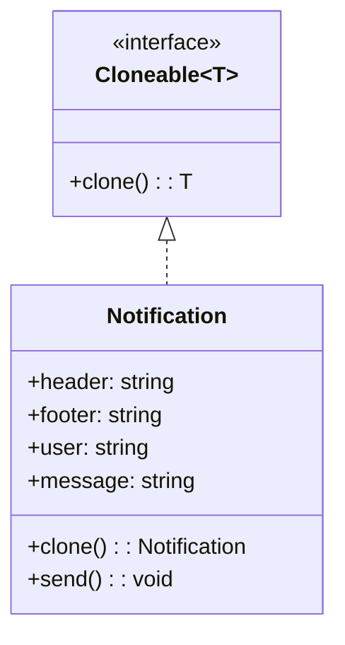

import Tabs from "@theme/Tabs";
import TabItem from "@theme/TabItem";
import CodeBlock from "@theme/CodeBlock";

import tsCode from "@site/src/codes/hardcoded-variability/ts/rfc_prototype.ts";
import phpCode from "@site/src/codes/hardcoded-variability/php/rfc_prototype.php";
import pyCode from "@site/src/codes/hardcoded-variability/py/rfc_prototype.py";

# 🧩 Prototype Pattern

## ✅ Intent

- Create new objects by **cloning a prototype** rather than instantiating from scratch
- Reuse a **pre-configured object** as a base and apply only the necessary differences

## ✅ Motivation

- Avoid hardcoding the entire configuration of an object every time
- Instead, maintain a **single source of truth** and clone it for variations

## ✅ When to Use

- When object creation involves **expensive setup or many default values**
- You need to generate many similar instances with **minor differences**
- You're dealing with **notification templates**, **configuration sets**, or **UI components**

## ✅ Code Example

<Tabs groupId="language">
  <TabItem value="ts" label="TypeScript">
    <CodeBlock language="ts">{tsCode}</CodeBlock>
  </TabItem>
  <TabItem value="php" label="PHP">
    <CodeBlock language="php">{phpCode}</CodeBlock>
  </TabItem>
  <TabItem value="python" label="Python">
    <CodeBlock language="python">{pyCode}</CodeBlock>
  </TabItem>
</Tabs>

## ✅ Explanation

This code uses the `Prototype` pattern to create new `Notification` objects by cloning a **pre-initialized instance**.

Each clone inherits all base properties and logic (e.g. headers, formatting rules), and can then be customized with user-specific content before sending.

### 1. Prototype Pattern Overview

- **Prototype**: An interface or base class that defines a cloning method  
  → `Cloneable<T>`

- **ConcretePrototype**: Implements the cloning logic and serves as the base for duplication  
  → `Notification`

- **Client**: Clones the prototype and updates only the necessary fields before use

### 2. Key Classes and Responsibilities

- `Cloneable<T>`

  - Defines the `clone()` method
  - Ensures each prototype instance can be duplicated

- `Notification`

  - Implements `Cloneable`
  - Provides `clone()` and `send()` methods
  - Base template can be cloned and reused with customized content

- Client Code
  - Creates a base prototype with fixed settings
  - Clones it for each user/message and customizes as needed

### 3. UML Class Diagram

### 4. Benefits of the Prototype Pattern

- **Avoids duplication**: Write setup logic once and reuse it through cloning
- **Efficient object creation**: Especially useful when instantiation is complex or resource-intensive
- **Flexible extension**: Add variations by modifying clones instead of subclassing

This design is ideal for building systems that need to generate **multiple pre-configured objects with slight variations**, such as email templates, UI components, or configuration snapshots.
