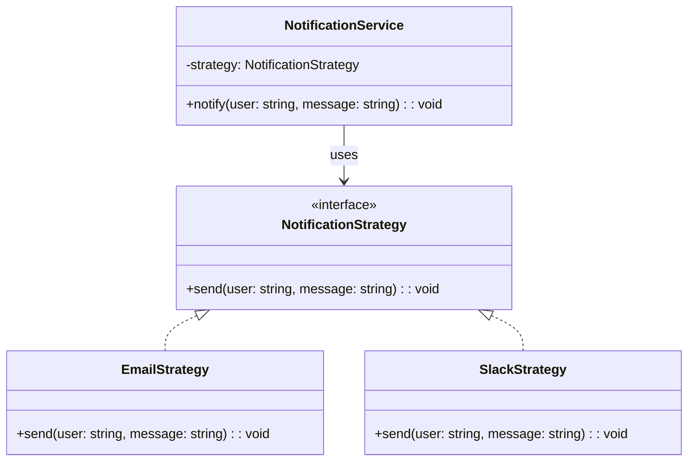

import Tabs from "@theme/Tabs";
import TabItem from "@theme/TabItem";
import CodeBlock from "@theme/CodeBlock";

import tsCode from "@site/src/codes/hardcoded-variability/ts/rfc_strategy.ts";
import phpCode from "@site/src/codes/hardcoded-variability/php/rfc_strategy.php";
import pyCode from "@site/src/codes/hardcoded-variability/py/rfc_strategy.py";

# 🧩 Strategy Pattern

## ✅ Intent

- **Allow dynamic selection of behavior** by injecting interchangeable strategies
- Separate the "what changes" (format, logic, output) from "what stays the same" (execution flow)

## ✅ Motivation

- You want to switch between different behaviors like Email vs Slack notification
- You don’t want to hardcode `if` or `switch` logic every time you send a message

## ✅ When to Use

- Behavior needs to be configurable at runtime
- You need to test or reuse each variation independently

## ✅ Code Example

<Tabs groupId="language">
  <TabItem value="ts" label="TypeScript">
    <CodeBlock language="ts">{tsCode}</CodeBlock>
  </TabItem>
  <TabItem value="php" label="PHP">
    <CodeBlock language="php">{phpCode}</CodeBlock>
  </TabItem>
  <TabItem value="python" label="Python">
    <CodeBlock language="python">{pyCode}</CodeBlock>
  </TabItem>
</Tabs>

## ✅ Explanation

This code uses the `Strategy` pattern to encapsulate different notification methods (Email, Slack), and enables switching between them at runtime by injecting the strategy into a shared service.

The `Strategy` pattern encapsulates a family of algorithms (in this case, notification methods), making them interchangeable without modifying the client logic.

### 1. Strategy Pattern Overview

- **Strategy**: Defines a common interface for interchangeable behaviors  
  → `NotificationStrategy`

- **ConcreteStrategy**: Implements different variants of the algorithm  
  → `EmailStrategy`, `SlackStrategy`

- **Context**: Uses the strategy and delegates behavior to it  
  → `NotificationService`

### 2. Key Classes and Responsibilities

- `NotificationStrategy`

  - Common interface for notification methods
  - Method: `send(user: string, message: string): void`

- `EmailStrategy`

  - Sends notification via Email

- `SlackStrategy`

  - Sends notification via Slack

- `NotificationService`
  - Uses a strategy object to perform notifications
  - Strategy can be switched dynamically (e.g. for testing, config-based behavior, etc.)

### 3. UML Class Diagram

### 4. Benefits of the Strategy Pattern

- **Runtime flexibility**: Swap in new strategies without modifying client logic
- **Open/Closed Principle**: Add new notification formats without touching existing code
- **Improved testability**: Each strategy is isolated and easily mockable

This design solves the problem of hardcoded conditionals for variable behaviors. It enables you to inject variability while keeping the surrounding logic consistent and reusable.
