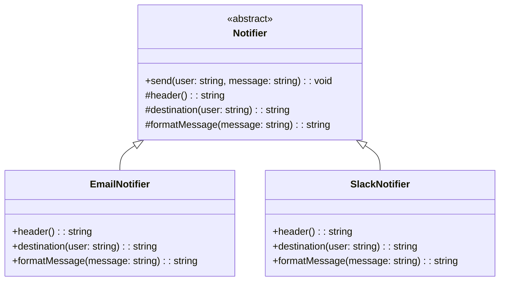

import Tabs from "@theme/Tabs";
import TabItem from "@theme/TabItem";
import CodeBlock from "@theme/CodeBlock";

import tsCode from "@site/src/codes/hardcoded-variability/ts/rfc_template.ts";
import phpCode from "@site/src/codes/hardcoded-variability/php/rfc_template.php";
import pyCode from "@site/src/codes/hardcoded-variability/py/rfc_template.py";

# 🧩 Template Method Pattern

## ✅ Intent

- Define the **skeleton of an algorithm** in a base class and allow **subclasses to override specific steps**
- Clarify where variation occurs, while ensuring the core logic remains consistent

## ✅ Motivation

- You want to avoid **duplicating the same processing flow** in every notification type
- Common logic (like logging, validation, structure) should be written once
- Differences (such as formatting or destination) can be **safely delegated to subclasses**

## ✅ When to Use

- The overall **process is fixed**, but some **steps vary**
- You want to **enforce a consistent flow** and **delegate differences**
- Ideal for message sending, form handling, lifecycle hooks, etc.

## ✅ Code Example

<Tabs groupId="language">
  <TabItem value="ts" label="TypeScript">
    <CodeBlock language="ts">{tsCode}</CodeBlock>
  </TabItem>
  <TabItem value="php" label="PHP">
    <CodeBlock language="php">{phpCode}</CodeBlock>
  </TabItem>
  <TabItem value="python" label="Python">
    <CodeBlock language="python">{pyCode}</CodeBlock>
  </TabItem>
</Tabs>

## ✅ Explanation

This example applies the `Template Method` pattern to encapsulate the **common steps** of sending a notification into an abstract class (`Notifier`),
while allowing different implementations (like `EmailNotifier` and `SlackNotifier`) to define their own behavior for formatting and delivery.

### 1. Template Method Pattern Overview

- **AbstractClass**: Defines the overall algorithm and declares abstract steps  
  → `Notifier`

- **ConcreteClass**: Implements the specific steps defined in the abstract class  
  → `EmailNotifier`, `SlackNotifier`

### 2. Key Classes and Responsibilities

- `Notifier`

  - The abstract base class
  - Defines the common `send` flow:
    - Generate header
    - Format message
    - Output destination
  - Delegates `header()`, `destination()`, and `formatMessage()` to subclasses

- `EmailNotifier`

  - Implements email-specific header, destination, and message formatting

- `SlackNotifier`
  - Implements Slack-specific behavior for the same steps

### 3. UML Class Diagram

### 4. Benefits of the Template Method Pattern

- **Consistency**: All subclasses follow the same structure
- **DRY Principle**: Common logic is centralized and not duplicated
- **Ease of Extension**: New variants only need to implement a few methods
- **Separation of Concerns**: Core flow is separated from customizable details

This pattern is highly effective when you have **shared procedures** across multiple variations, with **only a few parts that change**.
It simplifies maintenance and ensures a consistent structure across all implementations.
