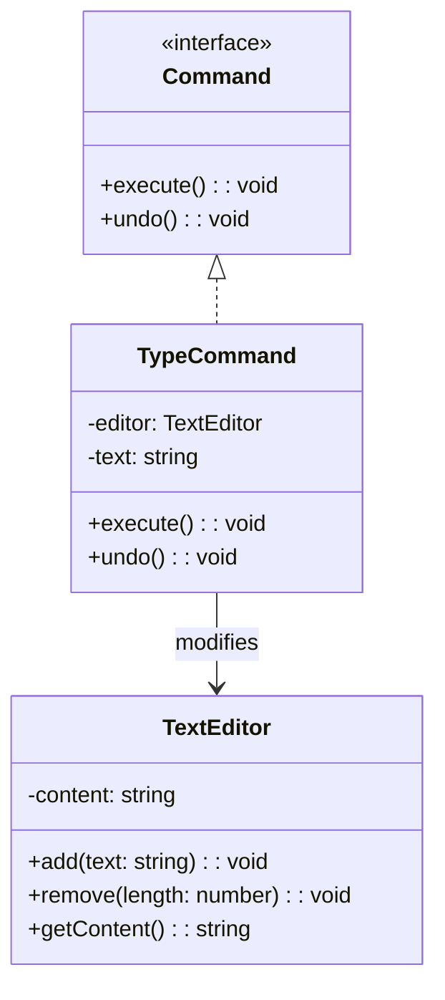

import Tabs from "@theme/Tabs";
import TabItem from "@theme/TabItem";
import CodeBlock from "@theme/CodeBlock";

import tsCode from "@site/src/codes/no-undo-history/ts/rfc_command.ts";
import phpCode from "@site/src/codes/no-undo-history/php/rfc_command.php";
import pyCode from "@site/src/codes/no-undo-history/py/rfc_command.py";

# 🧩 Command Pattern

## ✅ Intent

- Represent each user action as a **command object** that can be **executed**, **undone**, and **redone**
- Encapsulate operations to enable flexible undo/redo and history tracking

## ✅ Motivation

- Ideal for implementing **Undo/Redo functionality** in text editors, GUIs, and batch operations
- Allows you to **log, test, or replay** operations individually

## ✅ When to Use

- In systems like text editors, forms, batch processors, or GUI components
- When you want to separate the "action" from the "receiver" and support **reversible operations**

## ✅ Code Example

<Tabs groupId="language">
  <TabItem value="ts" label="TypeScript">
    <CodeBlock language="ts">{tsCode}</CodeBlock>
  </TabItem>
  <TabItem value="php" label="PHP">
    <CodeBlock language="php">{phpCode}</CodeBlock>
  </TabItem>
  <TabItem value="python" label="Python">
    <CodeBlock language="python">{pyCode}</CodeBlock>
  </TabItem>
</Tabs>

## ✅ Explanation

This code uses the `Command` pattern to encapsulate actions (like typing text) into command objects.  
These command objects are stored in a history list and can be undone later using the `undo()` method.

### 1. Overview of the Command Pattern

- **Command**: Declares the interface for executing and undoing an operation

  - Here: `Command`

- **ConcreteCommand**: Implements the command interface and defines a binding between the action and the receiver

  - Here: `TypeCommand`

- **Receiver**: Knows how to perform the operations associated with a request

  - Here: `TextEditor`

- **Invoker**: Executes the command and stores it for potential undo
  - Here: The `history` array serves this role

### 2. Key Classes and Their Roles

- `Command`

  - Defines `execute()` and `undo()` methods

- `TypeCommand`

  - A concrete implementation of `Command`
  - Adds text to the editor on `execute()`, and removes it on `undo()`

- `TextEditor`

  - The receiver of the command
  - Manages the text buffer and provides the actual editing operations

- Client Code
  - Creates `TypeCommand` objects, executes them, and stores them in a history list
  - Can call `undo()` on the last command to reverse the operation

### 3. UML Class Diagram

### 4. Benefits of the Command Pattern

- **Encapsulation of Operations**: Each action is self-contained and easy to store and execute later
- **Undo/Redo Support**: Commands can be stored and reversed using the `undo()` method
- **Flexible History Tracking**: Enables logging, replaying, or testing actions independently

This pattern is especially useful when you need to **track and manage user actions** over time—providing a solid foundation for **undo/redo systems** and command histories.
