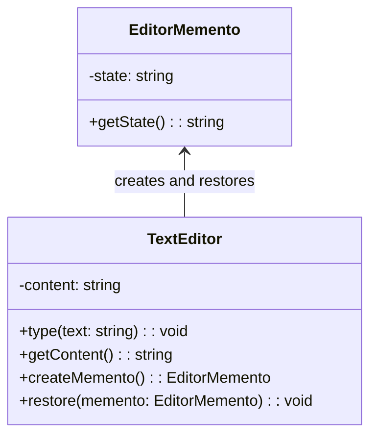

import Tabs from "@theme/Tabs";
import TabItem from "@theme/TabItem";
import CodeBlock from "@theme/CodeBlock";

import tsCode from "@site/src/codes/no-undo-history/ts/rfc_memento.ts";
import phpCode from "@site/src/codes/no-undo-history/php/rfc_memento.php";
import pyCode from "@site/src/codes/no-undo-history/py/rfc_memento.py";

# 🧩 Memento Pattern

## ✅ Intent

- Save and restore an object's **internal state** without exposing its internal structure
- Provide the ability to **undo or rollback** to a previous state

## ✅ Motivation

- Useful when you want to **save a snapshot** of the system at a specific moment
- Designed for **full-state restoration**, not just inverse actions

## ✅ When to Use

- Form inputs, save features in games, autosave systems in editors
- When state management is critical and you need **reversible transitions**

## ✅ Code Example

<Tabs groupId="language">
  <TabItem value="ts" label="TypeScript">
    <CodeBlock language="ts">{tsCode}</CodeBlock>
  </TabItem>
  <TabItem value="php" label="PHP">
    <CodeBlock language="php">{phpCode}</CodeBlock>
  </TabItem>
  <TabItem value="python" label="Python">
    <CodeBlock language="python">{pyCode}</CodeBlock>
  </TabItem>
</Tabs>

## ✅ Explanation

This code uses the `Memento` pattern to save and restore the state of a text editor.  
The `TextEditor` (originator) creates `EditorMemento` (mementos) to store its state and uses them to restore past content.

### 1. Overview of the Memento Pattern

- **Memento**: Stores the internal state of the originator

  - Here: `EditorMemento`

- **Originator**: Creates and restores mementos

  - Here: `TextEditor`

- **Caretaker**: Manages the history of mementos
  - Here: A `history` list holds the saved mementos

### 2. Key Classes and Their Roles

- `EditorMemento`

  - Holds a snapshot of the editor’s content
  - Exposes a `getState()` method for recovery

- `TextEditor`

  - Originator that maintains current text
  - Has `createMemento()` to save state and `restore(memento)` to revert

- `Caretaker`
  - Stores the mementos and handles when to save/restore
  - Here, the `history` array manages this role

### 3. UML Class Diagram

### 4. Benefits of the Memento Pattern

- **State Preservation**: Saves and restores internal state without exposing implementation details
- **Encapsulation Friendly**: Originator's internal data remains hidden from external classes
- **History Management**: Enables clean implementation of undo/redo systems

This pattern is ideal when you need to **capture full snapshots** of an object's state and **revert to previous versions**.  
It is particularly useful in applications like form editors, games, and any situation where rollback is critical.
