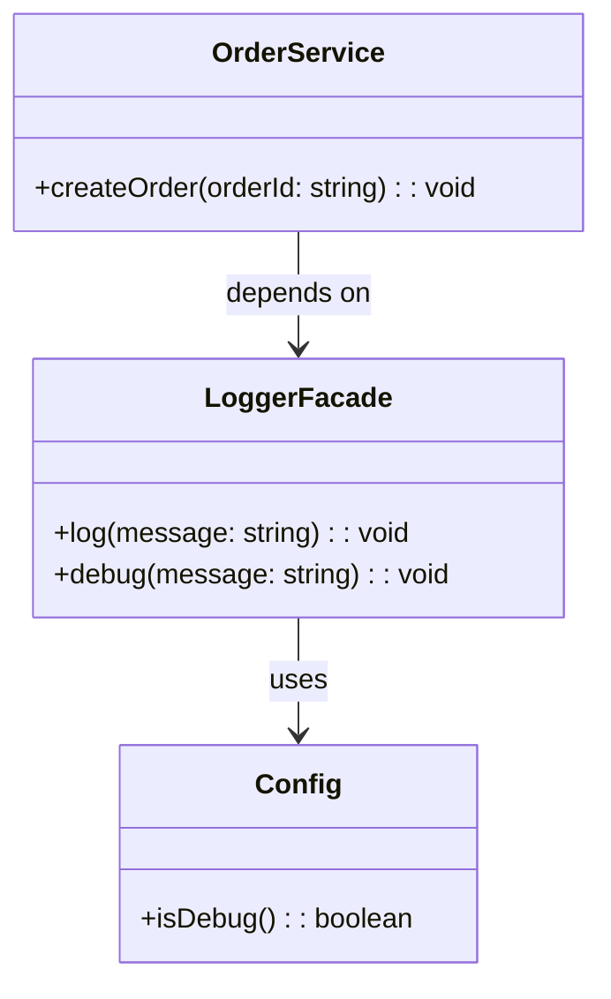

import Tabs from "@theme/Tabs";
import TabItem from "@theme/TabItem";
import CodeBlock from "@theme/CodeBlock";

import tsCode from "@site/src/codes/scattered-concerns/ts/rfc_facade.ts";
import phpCode from "@site/src/codes/scattered-concerns/php/rfc_facade.php";
import pyCode from "@site/src/codes/scattered-concerns/py/rfc_facade.py";

# 🧩 Facade Pattern

## ✅ Intent

- Combine multiple underlying systems—such as logging and configuration—into a **single, simplified interface**
- Allow clients to use a **clean API** without needing to know about internal complexities

## ✅ Motivation

- Abstract and hide the details of how logs are written and configuration values are retrieved
- Ensure that client code is **not affected** even if external libraries or implementations change

## ✅ When to Use

- When a **subsystem becomes complex** and the goal is to offer a **simple and unified access point**

## ✅ Code Example

<Tabs groupId="language">
  <TabItem value="ts" label="TypeScript">
    <CodeBlock language="ts">{tsCode}</CodeBlock>
  </TabItem>
  <TabItem value="php" label="PHP">
    <CodeBlock language="php">{phpCode}</CodeBlock>
  </TabItem>
  <TabItem value="python" label="Python">
    <CodeBlock language="python">{pyCode}</CodeBlock>
  </TabItem>
</Tabs>

## ✅ Explanation

This code uses the `Facade` pattern to introduce a `LoggerFacade` that simplifies how log output and debug checks are handled.  
The `Facade` pattern provides a unified interface to a set of interfaces in a subsystem, making it easier for clients to use the subsystem.

### 1. Overview of the Facade Pattern

- **Subsystem Classes**: Classes that provide the actual logic behind the scenes

  - In this case: `Config`

- **Facade**: Provides a simplified, high-level API for the subsystem

  - In this case: `LoggerFacade`

- **Client**: Uses the `Facade` rather than interacting with each subsystem class directly
  - In this case: `OrderService`

### 2. Key Classes and Their Roles

- `Config`

  - A subsystem component
  - Reads environment variables (like `DEBUG_MODE`) to determine debug behavior

- `LoggerFacade`

  - The `Facade` class
  - Provides a unified interface for logging (including debug-only logging)
  - Internally uses `Config` to determine behavior

- `OrderService`
  - Client class
  - Logs messages through `LoggerFacade`, with no need to understand debug configuration

### 3. UML Class Diagram

### 4. Benefits of the Facade Pattern

- **Simplified Interface**: Clients don’t need to understand or manage the subsystem directly
- **Loose Coupling**: Client and subsystem are decoupled via the facade
- **Better Maintainability**: Changes in the subsystem are encapsulated within the facade, reducing client-side impact

This design is ideal when simplifying complex internal logic is necessary, or when offering a **stable and clean interface** to potentially volatile underlying code.  
It improves both **readability** and **maintainability**.
