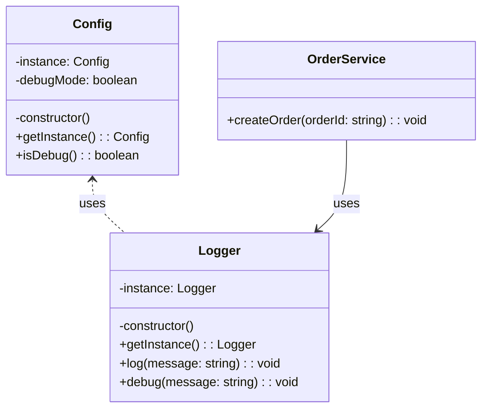

import Tabs from "@theme/Tabs";
import TabItem from "@theme/TabItem";
import CodeBlock from "@theme/CodeBlock";

import tsCode from "@site/src/codes/scattered-concerns/ts/rfc_singleton.ts";
import phpCode from "@site/src/codes/scattered-concerns/php/rfc_singleton.php";
import pyCode from "@site/src/codes/scattered-concerns/py/rfc_singleton.py";

# 🧩 Singleton Pattern

## ✅ Intent

- Ensure that classes like `Logger` or `Config` are instantiated **only once** and **reused globally**
- Provide **centralized control and access** to shared state across the application

## ✅ Motivation

- Ideal for cases where **"the same instance should be used everywhere"**
- Helps **unify log formatting** and **centralize configuration management**

## ✅ When to Use

- When building utilities like **logging, configuration, caching, or DB connections** that require a shared, single state

## ✅ Code Example

<Tabs groupId="language">
  <TabItem value="ts" label="TypeScript">
    <CodeBlock language="ts">{tsCode}</CodeBlock>
  </TabItem>
  <TabItem value="php" label="PHP">
    <CodeBlock language="php">{phpCode}</CodeBlock>
  </TabItem>
  <TabItem value="python" label="Python">
    <CodeBlock language="python">{pyCode}</CodeBlock>
  </TabItem>
</Tabs>

## ✅ Explanation

This code uses the `Singleton` pattern to ensure that `Config` and `Logger` are instantiated only once across the application.  
The `Singleton` pattern guarantees a single instance and provides **global access** to it throughout the codebase.

### 1. Overview of the Singleton Pattern

- **Singleton**: A class that ensures a single instance and exposes a global access point

  - In this example: `Config` and `Logger`

- **Client**: Uses the singleton instance
  - In this example: `OrderService`

### 2. Key Classes and Their Roles

- `Config`

  - A singleton class that manages application settings
  - Uses environment variable `DEBUG_MODE` to determine if debug mode is enabled

- `Logger`

  - A singleton class that provides logging functionality
  - Outputs debug logs only when debug mode is enabled

- `OrderService`
  - A client class that logs order creation via the shared `Logger` instance

### 3. UML Class Diagram

### 4. Benefits of the Singleton Pattern

- **Unique Instance**: Guarantees exactly one instance throughout the application
- **Global Access**: The instance can be accessed from anywhere using `getInstance`
- **Resource Saving**: Enables lazy initialization to avoid unnecessary object creation

:::warning

- **Testing Difficulty**: Global state can make unit testing harder due to tight coupling and lack of dependency injection
- **Risk of Overuse**: Overusing Singletons can lead to tightly coupled code and reduced maintainability

:::

This pattern is highly effective when managing shared resources like configuration or logging across an entire application.  
However, **careful and deliberate use is recommended** to avoid the pitfalls of global state and tight coupling.
