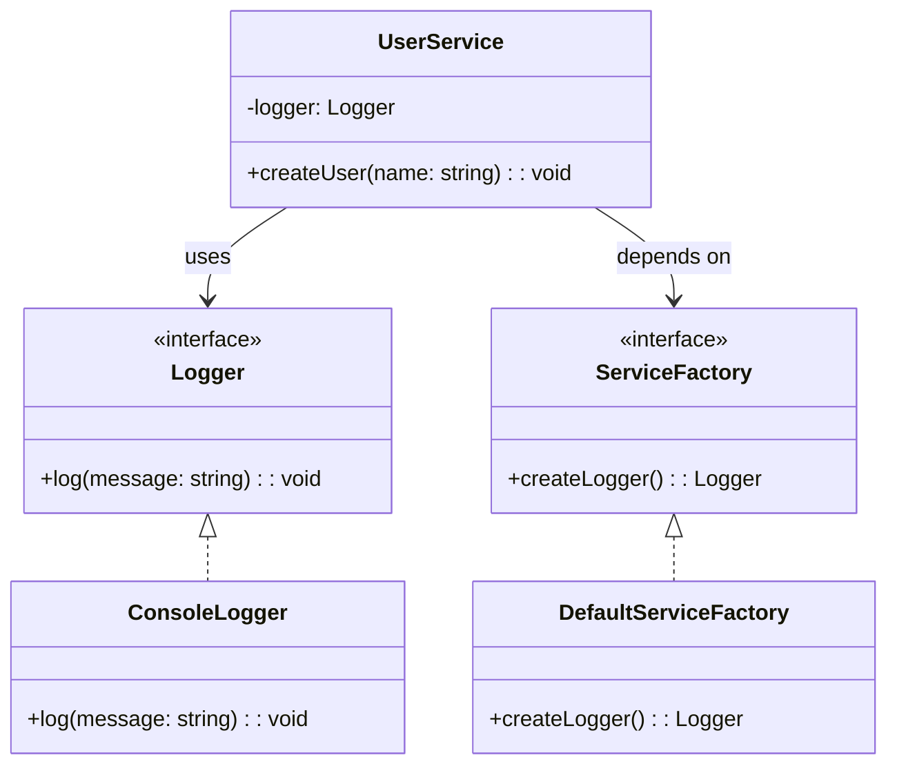

import Tabs from "@theme/Tabs";
import TabItem from "@theme/TabItem";
import CodeBlock from "@theme/CodeBlock";

import tsCode from "@site/src/codes/scattered-instaniation/ts/rfc_abstract.ts";
import phpCode from "@site/src/codes/scattered-instaniation/php/rfc_abstract.php";
import pyCode from "@site/src/codes/scattered-instaniation/py/rfc_abstract.py";

# 🧩 Abstract Factory Pattern

## ✅ Intent

- Provide a single **entry point to create a set of related objects** (e.g., Logger + Database)
- Allow switching the entire object family depending on environment or version

## ✅ Motivation

- Enable swapping out multiple dependencies as a group
- Customize object instantiation based on the implementation

## ✅ When to Use

- When switching dependencies based on environment (e.g., staging vs production)
- When managing themes, storage providers, or other swappable components

## ✅ Code Example

<Tabs groupId="language">
  <TabItem value="ts" label="TypeScript">
    <CodeBlock language="ts">{tsCode}</CodeBlock>
  </TabItem>
  <TabItem value="php" label="PHP">
    <CodeBlock language="php">{phpCode}</CodeBlock>
  </TabItem>
  <TabItem value="python" label="Python">
    <CodeBlock language="python">{pyCode}</CodeBlock>
  </TabItem>
</Tabs>

## ✅ Explanation

This code applies the `Abstract Factory` pattern to delegate the creation of related objects (such as `Logger`) to a factory,  
thereby hiding the instantiation details from the client.  
The `Abstract Factory` pattern provides an interface for creating families of related objects and delegates instantiation logic to subclasses.

### 1. Overview of the Abstract Factory Pattern

- **AbstractFactory**: Defines the interface for creating products

  - Represented by `ServiceFactory` in this code

- **ConcreteFactory**: Implements the `AbstractFactory` interface and provides the actual product creation logic

  - Represented by `DefaultServiceFactory`

- **Product**: The object to be created by the abstract factory

  - Represented by `Logger`

- **ConcreteProduct**: The actual implementation of the product

  - Represented by `ConsoleLogger`

- **Client**: Uses the `AbstractFactory` to create and consume the product
  - Represented by `UserService`

### 2. Key Classes and Their Roles

- `Logger`

  - The common interface for all loggers
  - Declares the method `log(message: string): void`

- `ConsoleLogger`

  - A concrete product implementing `Logger`
  - Outputs log messages to the console

- `ServiceFactory`

  - The abstract factory
  - Declares the method `createLogger`, which is responsible for creating a `Logger`

- `DefaultServiceFactory`

  - A concrete factory implementing `ServiceFactory`
  - Returns an instance of `ConsoleLogger`

- `UserService`
  - The client class
  - Receives a `ServiceFactory` in its constructor and uses it to create and use a `Logger`

### 3. UML Class Diagram

### 4. Benefits of the Abstract Factory Pattern

- **Encapsulation of Creation Logic**: The client does not need to know how the product is created
- **Consistent Product Creation**: Related products (e.g., different types of loggers) can be created consistently
- **Extensibility**: New factories and products can be added without modifying existing code

This design unifies the creation of related objects and separates the creation logic from the client.  
It is especially useful when multiple products are related or when the creation logic is expected to evolve.
