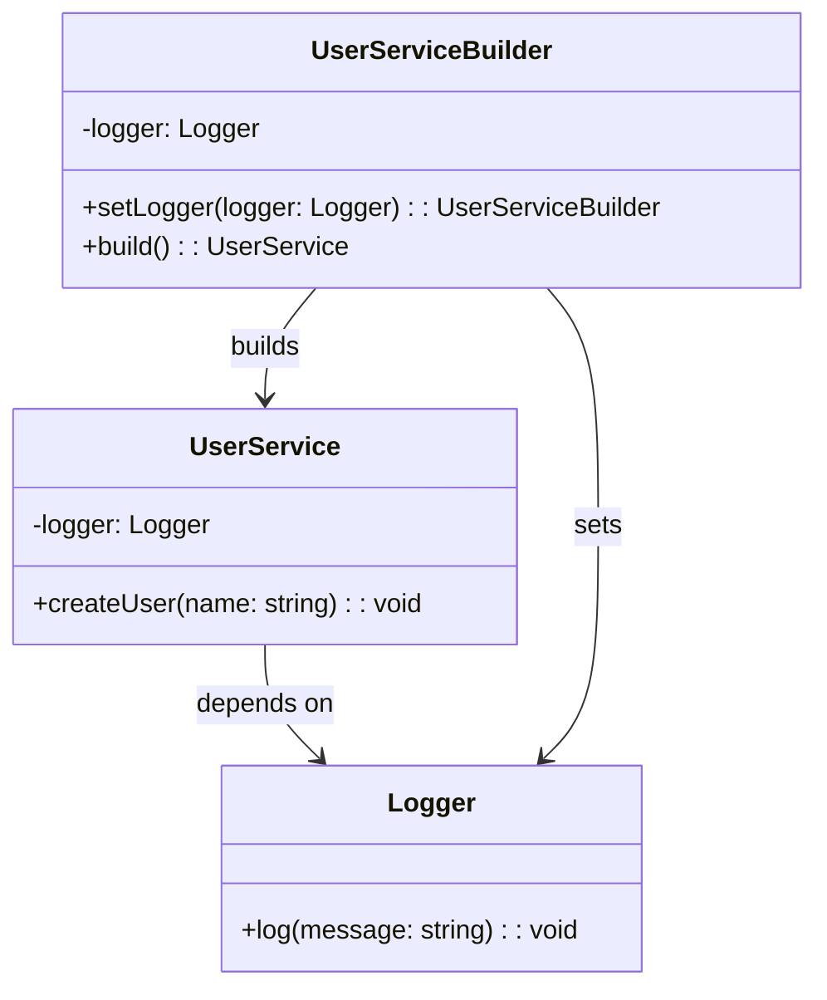

import Tabs from "@theme/Tabs";
import TabItem from "@theme/TabItem";
import CodeBlock from "@theme/CodeBlock";

import tsCode from "@site/src/codes/scattered-instaniation/ts/rfc_builder.ts";
import phpCode from "@site/src/codes/scattered-instaniation/php/rfc_builder.php";
import pyCode from "@site/src/codes/scattered-instaniation/py/rfc_builder.py";

# 🧩 Builder Pattern

## ✅ Intent

- Construct complex objects **step-by-step**
- Use the same construction process to **create different representations**

## ✅ Motivation

- Helps manage initialization when there are many property combinations
- Allows for controlled construction with **optional parameters, ordering, and validation**

## ✅ When to Use

- When initializing objects with many options, such as forms or configuration objects

## ✅ Code Example

<Tabs groupId="language">
  <TabItem value="ts" label="TypeScript">
    <CodeBlock language="ts">{tsCode}</CodeBlock>
  </TabItem>
  <TabItem value="php" label="PHP">
    <CodeBlock language="php">{phpCode}</CodeBlock>
  </TabItem>
  <TabItem value="python" label="Python">
    <CodeBlock language="python">{pyCode}</CodeBlock>
  </TabItem>
</Tabs>

## ✅ Explanation

This code applies the `Builder` pattern to construct a complex object (`UserService`) in a step-by-step manner.  
The `Builder` pattern separates the construction process, enabling flexible and safe object creation.

### 1. Overview of the Builder Pattern

- **Builder**: Defines the steps required to construct the object

  - Represented by `UserServiceBuilder` in this code

- **Product**: The object being constructed

  - Represented by `UserService`

- **Client**: Uses the builder to construct the object
  - In this code, the part that uses `UserServiceBuilder` to create a `UserService` instance

### 2. Key Classes and Their Roles

- `Logger`

  - Utility class for logging
  - Used as a dependency of `UserService`

- `UserService`

  - The target class (Product)
  - Provides user creation functionality and uses `Logger` to output logs

- `UserServiceBuilder`

  - The builder class
  - Uses `setLogger` to set a logger, and `build` to create a `UserService`
  - Throws an error if required dependencies (e.g., `Logger`) are not provided

- Client Code
  - Uses `UserServiceBuilder` to construct `UserService`
  - Sets the required dependencies and calls `build` to create the instance

### 3. UML Class Diagram

### 4. Benefits of the Builder Pattern

- **Flexibility**: Dependencies can be set in stages
- **Safety**: Prevents incomplete objects by throwing errors when required dependencies are missing
- **Readability**: Method chaining provides a clear and intuitive construction process

This design enables safe and flexible construction of complex objects. It is especially useful when objects have many dependencies or require a detailed creation sequence.
