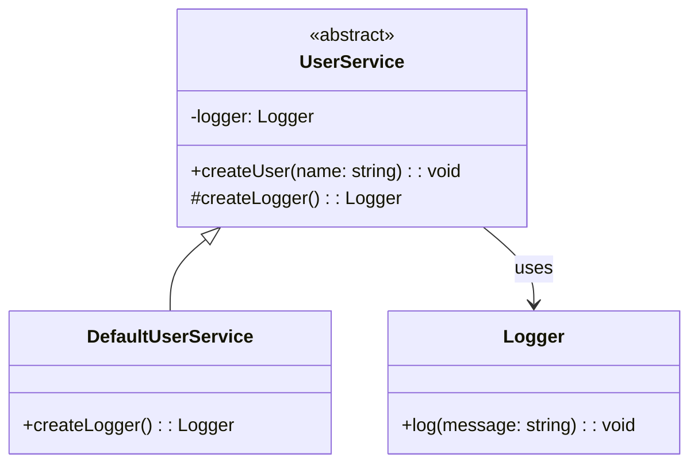

import Tabs from "@theme/Tabs";
import TabItem from "@theme/TabItem";
import CodeBlock from "@theme/CodeBlock";

import tsCode from "@site/src/codes/scattered-instaniation/ts/rfc_factory.ts";
import phpCode from "@site/src/codes/scattered-instaniation/php/rfc_factory.php";
import pyCode from "@site/src/codes/scattered-instaniation/py/rfc_factory.py";

# 🧩 Factory Method Pattern

## ✅ Intent

- Delegate **"which class to instantiate"** to subclasses
- Centralize object creation to improve **flexibility and extensibility**

## ✅ Motivation

- Manage shared utilities like `Logger` using a common factory method
- Simplifies switching implementations or injecting mocks

## ✅ When to Use

- When you need to switch the concrete class based on version or conditions
- When designing for extensibility at the framework level

## ✅ Code Example

<Tabs groupId="language">
  <TabItem value="ts" label="TypeScript">
    <CodeBlock language="ts">{tsCode}</CodeBlock>
  </TabItem>
  <TabItem value="php" label="PHP">
    <CodeBlock language="php">{phpCode}</CodeBlock>
  </TabItem>
  <TabItem value="python" label="Python">
    <CodeBlock language="python">{pyCode}</CodeBlock>
  </TabItem>
</Tabs>

## ✅ Explanation

This code applies the `Factory Method` pattern to delegate the responsibility of object creation to subclasses.  
The `Factory Method` pattern encapsulates the creation logic, allowing subclasses to customize the instantiation process.

### 1. Overview of the Factory Method Pattern

- **Creator**: Defines an abstract method (`Factory Method`) responsible for object creation

  - Represented by `UserService` in this code

- **ConcreteCreator**: Implements the `Factory Method` and provides the actual instantiation logic

  - Represented by `DefaultUserService`

- **Product**: The object created by the factory method
  - Represented by `Logger`

### 2. Key Classes and Their Roles

- `Logger`

  - The concrete product created by the factory method
  - Provides logging functionality

- `UserService`

  - The `Creator` class
  - Declares the abstract method `createLogger` and delegates the creation logic to subclasses
  - Uses `Logger` within the `createUser` method

- `DefaultUserService`
  - The `ConcreteCreator` class
  - Implements `createLogger` and returns a concrete instance of `Logger`

### 3. UML Class Diagram

### 4. Benefits of the Factory Method Pattern

- **Customizable Creation Logic**: Subclasses can override the factory method to control which object gets instantiated
- **Loose Coupling**: The `Creator` class does not depend on concrete `Product` classes, enabling better extensibility
- **Reusability**: Centralizing instantiation via a factory method promotes consistent and reusable creation logic

This design separates the responsibility of object creation and makes the instantiation process more flexible.  
It is especially useful when the created objects may vary or when the creation logic becomes complex.
