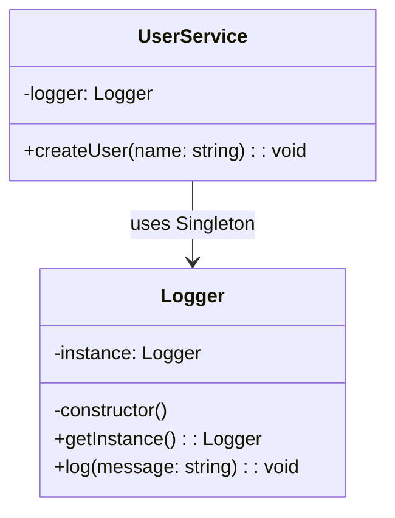

import Tabs from "@theme/Tabs";
import TabItem from "@theme/TabItem";
import CodeBlock from "@theme/CodeBlock";

import tsCode from "@site/src/codes/scattered-instaniation/ts/rfc_singleton.ts";
import phpCode from "@site/src/codes/scattered-instaniation/php/rfc_singleton.php";
import pyCode from "@site/src/codes/scattered-instaniation/py/rfc_singleton.py";

# 🧩 Singleton Pattern

## ✅ Intent

- Ensure that only **one instance** of a class exists and provide a global point of access to it

## ✅ Motivation

- When the same instance needs to be reused across the entire application
- Suitable for components that hold **shared state** like loggers, configuration managers, or caches

## ✅ When to Use

- For global utilities such as `Logger`, `ConfigManager`, etc.

## ✅ Code Example

<Tabs groupId="language">
  <TabItem value="ts" label="TypeScript">
    <CodeBlock language="ts">{tsCode}</CodeBlock>
  </TabItem>
  <TabItem value="php" label="PHP">
    <CodeBlock language="php">{phpCode}</CodeBlock>
  </TabItem>
  <TabItem value="python" label="Python">
    <CodeBlock language="python">{pyCode}</CodeBlock>
  </TabItem>
</Tabs>

## ✅ Explanation

This code applies the `Singleton` pattern to ensure that only one instance of the `Logger` class exists throughout the application.  
The `Singleton` pattern guarantees that a class has a single instance and provides a global access point to that instance.

### 1. Overview of the Singleton Pattern

- **Singleton**: Creates a single instance of a class and provides global access to it

  - Represented by `Logger` in this code

- **Client**: Uses the `Singleton` instance
  - Represented by `UserService`

### 2. Key Classes and Their Roles

- `Logger`

  - The `Singleton` class
  - Has a private constructor to prevent external instantiation
  - Provides the `getInstance` method to retrieve the sole instance
  - Offers log output functionality

- `UserService`
  - The client class
  - Retrieves the `Logger` singleton instance in its constructor and uses it for logging

### 3. UML Class Diagram

### 4. Benefits of the Singleton Pattern

- **Instance Uniqueness**: Only one instance is shared across the entire application
- **Global Access**: The instance can be accessed from anywhere using `getInstance`
- **Resource Efficiency**: Supports lazy initialization to avoid unnecessary resource usage

:::warning

- **Testing Challenges**: Since it holds global state, it can be difficult to mock or inject during unit testing
- **Risk of Overuse**: Excessive use of singletons can lead to tight coupling and decreased maintainability

:::

This design is highly effective for managing resources that need to be shared application-wide, such as logging.  
However, it should be used with caution and only in appropriate contexts.
