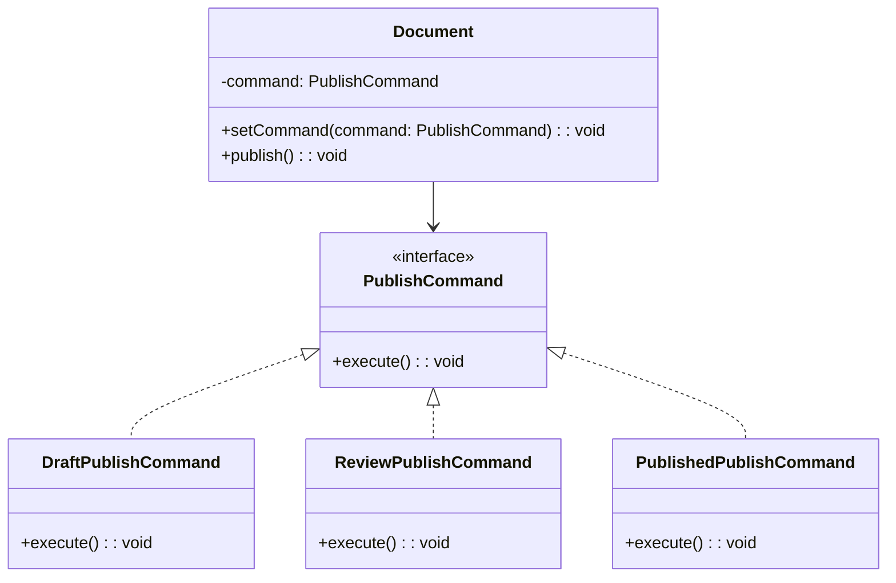

import Tabs from "@theme/Tabs";
import TabItem from "@theme/TabItem";
import CodeBlock from "@theme/CodeBlock";

import tsCode from "@site/src/codes/single-state-handling/ts/rfc_command.ts";
import phpCode from "@site/src/codes/single-state-handling/php/rfc_command.php";
import pyCode from "@site/src/codes/single-state-handling/py/rfc_command.py";

# 🧩 Command Pattern

## ✅ Intent

- Represent executable actions as **command objects**
- Execute different behaviors depending on the command, not the internal state

## ✅ Motivation

- Useful when the focus is on **substituting what gets executed**, rather than managing internal state
- Especially effective in cases involving **operation history, Undo/Redo, or deferred execution**

## ✅ Code Example

<Tabs groupId="language">
  <TabItem value="ts" label="TypeScript">
    <CodeBlock language="ts">{tsCode}</CodeBlock>
  </TabItem>
  <TabItem value="php" label="PHP">
    <CodeBlock language="php">{phpCode}</CodeBlock>
  </TabItem>
  <TabItem value="python" label="Python">
    <CodeBlock language="python">{pyCode}</CodeBlock>
  </TabItem>
</Tabs>

## ✅ Explanation

This code applies the `Command` pattern to encapsulate the document publishing logic as commands that can be switched dynamically.  
The `Command` pattern encapsulates an operation as an object, enabling delayed execution, flexible substitution, and reuse.

### 1. Overview of the Command Pattern

- **Command**: Defines the interface for encapsulated operations

  - Represented by `PublishCommand`

- **ConcreteCommand**: Implements the command interface with specific operations

  - Represented by `DraftPublishCommand`, `ReviewPublishCommand`, and `PublishedPublishCommand`

- **Invoker**: Responsible for executing the command

  - Represented by `Document`

- **Client**: Creates the appropriate command and passes it to the invoker
  - Represented by `new Document(new DraftPublishCommand())` in this code

### 2. Key Classes and Their Roles

- `PublishCommand`

  - Common interface for publishing commands
  - Declares the method `execute(): void`

- `DraftPublishCommand`, `ReviewPublishCommand`, `PublishedPublishCommand`

  - Concrete command classes implementing `PublishCommand`
  - Each class provides a different publishing behavior:
    - `DraftPublishCommand`: Sends a review request
    - `ReviewPublishCommand`: Publishes the document
    - `PublishedPublishCommand`: Indicates the document is already published

- `Document`
  - The invoker class
  - Accepts a `PublishCommand` via its constructor and executes it through the `publish` method
  - Allows dynamic command replacement via the `setCommand` method

### 3. UML Class Diagram

### 4. Benefits of the Command Pattern

- **Encapsulation of Operations**: Encapsulates actions as objects for deferred or dynamic execution
- **Flexibility**: New operations can be added simply by implementing `PublishCommand`
- **Reusable Invoker**: The `Document` class can execute any command, making it highly reusable

This design treats behavior as a first-class object, improving flexibility and extensibility.  
It is especially effective when you need to switch operations or manage execution history.
