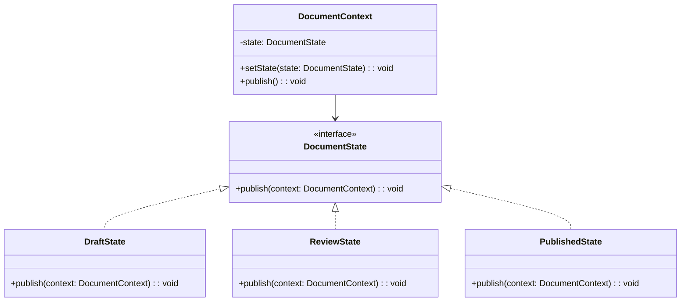

import Tabs from "@theme/Tabs";
import TabItem from "@theme/TabItem";
import CodeBlock from "@theme/CodeBlock";

import tsCode from "@site/src/codes/single-state-handling/ts/rfc_state.ts";
import phpCode from "@site/src/codes/single-state-handling/php/rfc_state.php";
import pyCode from "@site/src/codes/single-state-handling/py/rfc_state.py";

# 🧩 State Pattern

## ✅ Intent

- Represent an object's state as **dedicated classes**, with behavior defined per state
- The current state directly determines which behavior to execute

## ✅ Motivation

- Separates behavior per state into classes, ensuring **clear responsibility separation**
- Since each state object knows the transition rules, **state control is explicit and manageable**

## ✅ When to Use

- For UI or business flows involving steps, transitions, or mode switching
- When many states are expected and future expansion is likely

## ✅ Code Example

<Tabs groupId="language">
  <TabItem value="ts" label="TypeScript">
    <CodeBlock language="ts">{tsCode}</CodeBlock>
  </TabItem>
  <TabItem value="php" label="PHP">
    <CodeBlock language="php">{phpCode}</CodeBlock>
  </TabItem>
  <TabItem value="python" label="Python">
    <CodeBlock language="python">{pyCode}</CodeBlock>
  </TabItem>
</Tabs>

## ✅ Explanation

This code applies the `State` pattern to switch behavior based on the document's state (`Draft`, `Review`, `Published`).  
The `State` pattern allows an object to change its behavior based on its internal state, eliminating conditional branches and improving readability and maintainability.

### 1. Overview of the State Pattern

- **State**: Interface defining behavior for each state

  - Represented by `DocumentState` in this code

- **ConcreteState**: Implements the `State` interface and provides state-specific behavior

  - Represented by `DraftState`, `ReviewState`, and `PublishedState`

- **Context**: Maintains the current state and delegates behavior to it
  - Represented by `DocumentContext`

### 2. Key Classes and Their Roles

- `DocumentState`

  - Common interface for all states
  - Declares the method `publish(context: DocumentContext): void`

- `DraftState`

  - Concrete state for the "draft" phase
  - The `publish` method sends a review request and transitions to `ReviewState`

- `ReviewState`

  - Concrete state for the "under review" phase
  - The `publish` method publishes the document and transitions to `PublishedState`

- `PublishedState`

  - Concrete state for the "published" phase
  - The `publish` method outputs a message indicating that the document is already published

- `DocumentContext`
  - The context class that maintains the current state
  - Calls the state's `publish` method and manages transitions using `setState`

### 3. UML Class Diagram

### 4. Benefits of the State Pattern

- **Eliminates Conditional Branching**: Each state's logic is encapsulated in a separate class
- **Extensibility**: New states can be added by implementing `DocumentState`
- **Runtime Flexibility**: The state can be changed dynamically during execution

This design clearly separates behavior by state and allows safe, manageable state transitions.  
It is especially effective when multiple states exist and each has distinct behavior.
