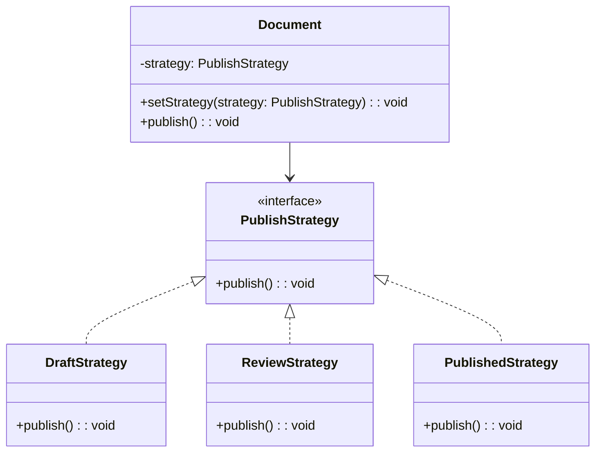

import Tabs from "@theme/Tabs";
import TabItem from "@theme/TabItem";
import CodeBlock from "@theme/CodeBlock";

import tsCode from "@site/src/codes/single-state-handling/ts/rfc_strategy.ts";
import phpCode from "@site/src/codes/single-state-handling/php/rfc_strategy.php";
import pyCode from "@site/src/codes/single-state-handling/py/rfc_strategy.py";

# 🧩 Strategy Pattern

## ✅ Intent

- Treat behavior as a **strategy injected from the outside**, rather than being determined by internal state
- State transitions are **managed externally**

## ✅ Motivation

- Useful when you want to **completely separate state from behavior**
- Ideal when the focus is purely on **switching behavior dynamically**

## ✅ When to Use

- When you don't need state management, and simply want to **switch logic** at runtime

## ✅ Code Example

<Tabs groupId="language">
  <TabItem value="ts" label="TypeScript">
    <CodeBlock language="ts">{tsCode}</CodeBlock>
  </TabItem>
  <TabItem value="php" label="PHP">
    <CodeBlock language="php">{phpCode}</CodeBlock>
  </TabItem>
  <TabItem value="python" label="Python">
    <CodeBlock language="python">{pyCode}</CodeBlock>
  </TabItem>
</Tabs>

## ✅ Explanation

This code applies the `Strategy` pattern by extracting the document publishing process into a strategy (`PublishStrategy`)  
that can be dynamically switched at runtime.  
The `Strategy` pattern encapsulates algorithms or operations in separate classes, making them interchangeable.

### 1. Overview of the Strategy Pattern

- **Strategy**: Defines a common interface to allow interchangeable behavior

  - Represented by `PublishStrategy`

- **ConcreteStrategy**: Implements the strategy interface with specific behavior

  - Represented by `DraftStrategy`, `ReviewStrategy`, and `PublishedStrategy`

- **Context**: Uses the strategy and allows switching behavior dynamically
  - Represented by `Document`

### 2. Key Classes and Their Roles

- `PublishStrategy`

  - Common interface for publishing behavior
  - Declares the method `publish(): void`

- `DraftStrategy`, `ReviewStrategy`, `PublishedStrategy`

  - Concrete strategy classes implementing `PublishStrategy`
  - Provide different publishing behaviors:
    - `DraftStrategy`: Sends a review request
    - `ReviewStrategy`: Publishes the document
    - `PublishedStrategy`: Indicates the document is already published

- `Document`
  - Context class
  - Receives a `PublishStrategy` in its constructor and executes the strategy via the `publish` method
  - Supports dynamic strategy switching via `setStrategy`

### 3. UML Class Diagram

### 4. Benefits of the Strategy Pattern

- **Flexibility**: Easily switch between different behaviors at runtime
- **Single Responsibility Principle**: Each strategy is isolated in its own class, improving maintainability
- **Extensibility**: New strategies can be added simply by implementing `PublishStrategy`

This design is highly effective when algorithms or operations need to be swapped flexibly,  
providing strong support for code extensibility and maintainability.
