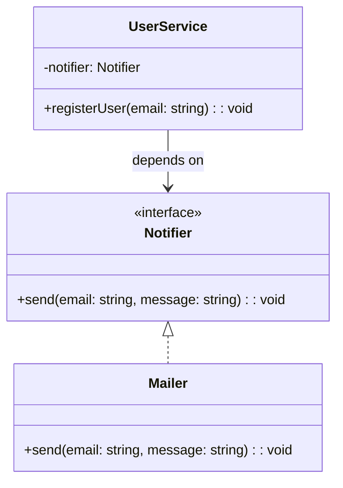

import Tabs from "@theme/Tabs";
import TabItem from "@theme/TabItem";
import CodeBlock from "@theme/CodeBlock";

import tsCode from "@site/src/codes/tight-coupling/ts/rfc_di.ts";
import phpCode from "@site/src/codes/tight-coupling/php/rfc_di.php";
import pyCode from "@site/src/codes/tight-coupling/py/rfc_di.py";

# 🧩 Dependency Injection (DI) Pattern

## ✅ Intent

- Instead of creating dependencies internally, **inject them from outside**
- Shifts the responsibility of "which implementation to use" **outside the class**, improving flexibility

## ✅ Motivation

- Makes it easy to **swap in mocks or stubs** for testing
- Allows changing the configuration of services **without modifying implementation code**

## ✅ When to Use

- In applications that support DI containers
- When you want to **explicitly manage class dependencies**

## ✅ Code Example

<Tabs groupId="language">
  <TabItem value="ts" label="TypeScript">
    <CodeBlock language="ts">{tsCode}</CodeBlock>
  </TabItem>
  <TabItem value="php" label="PHP">
    <CodeBlock language="php">{phpCode}</CodeBlock>
  </TabItem>
  <TabItem value="python" label="Python">
    <CodeBlock language="python">{pyCode}</CodeBlock>
  </TabItem>
</Tabs>

## ✅ Explanation

This code uses **Dependency Injection (DI)** to design a system where `UserService` receives its dependency (`Notifier`) from the outside.  
The DI pattern helps achieve loose coupling by **decoupling a class from the concrete implementation of its dependencies**.

### 1. Overview of Dependency Injection

- **Interface**: Defines a common abstraction for the dependency

  - Represented by `Notifier` in this code

- **Concrete Implementation**: Implements the interface and provides actual behavior

  - Represented by `Mailer`

- **Client**: Relies on the interface and receives the implementation externally
  - Represented by `UserService`

### 2. Key Classes and Their Roles

- `Notifier`

  - The interface representing a generic notification mechanism
  - Declares `send(email: string, message: string): void`

- `Mailer`

  - A concrete class that implements `Notifier`
  - Sends notifications via email

- `UserService`
  - The client class that depends on `Notifier`
  - Receives the dependency via constructor injection
  - After registering a user, it sends a notification using the injected `Notifier`

### 3. UML Class Diagram

### 4. Benefits of Dependency Injection

- **Loose Coupling**: `UserService` does not depend on a specific implementation like `Mailer`, making it easy to replace the dependency
- **Testability**: Easily inject mocks or stubs, simplifying unit testing
- **Extensibility**: New notification methods (e.g., SMS) can be added by implementing `Notifier` without modifying existing code

This design improves the flexibility and maintainability of code  
by managing dependencies externally. It's especially effective when dependencies may change or when improving testability is a priority.
