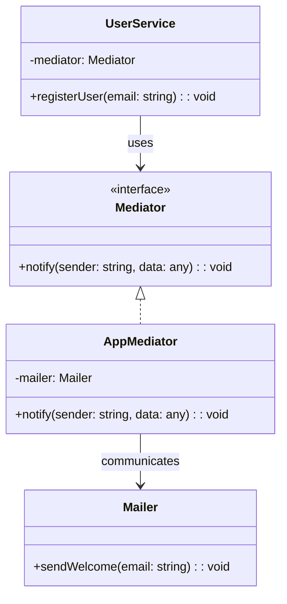

import Tabs from "@theme/Tabs";
import TabItem from "@theme/TabItem";
import CodeBlock from "@theme/CodeBlock";

import tsCode from "@site/src/codes/tight-coupling/ts/rfc_mediator.ts";
import phpCode from "@site/src/codes/tight-coupling/php/rfc_mediator.php";
import pyCode from "@site/src/codes/tight-coupling/py/rfc_mediator.py";

# 🧩 Mediator Pattern

## ✅ Intent

- Enable components to communicate **through a mediator** instead of referencing each other directly
- Centralize the relationships to make **interactions easier to manage**

## ✅ Motivation

- Useful when you want a **central coordinating class** to manage multiple components
- Allows components to remain **independent while still interacting**

## ✅ When to Use

- When you need to manage relationships between multiple components (e.g., UI, forms, or services)
- When you want to make **control flow and coordination more visible and manageable**

## ✅ Code Example

<Tabs groupId="language">
  <TabItem value="ts" label="TypeScript">
    <CodeBlock language="ts">{tsCode}</CodeBlock>
  </TabItem>
  <TabItem value="php" label="PHP">
    <CodeBlock language="php">{phpCode}</CodeBlock>
  </TabItem>
  <TabItem value="python" label="Python">
    <CodeBlock language="python">{pyCode}</CodeBlock>
  </TabItem>
</Tabs>

## ✅ Explanation

This code applies the `Mediator` pattern to remove direct dependencies between components (`UserService` and `Mailer`)  
and enables communication through a centralized `Mediator`.  
The `Mediator` pattern delegates communication between objects to a central mediator,  
thus reducing coupling between components.

### 1. Overview of the Mediator Pattern

- **Mediator**: Interface for mediating communication between components

  - Represented by `Mediator`

- **ConcreteMediator**: Implements the `Mediator` interface and contains the logic to coordinate components

  - Represented by `AppMediator`

- **Colleague**: Components that interact through the mediator
  - Represented by `UserService` and `Mailer`

### 2. Key Classes and Their Roles

- `Mediator`

  - Interface for coordinating component communication
  - Declares `notify(sender: string, data: any): void`

- `AppMediator`

  - Concrete implementation of `Mediator`
  - Handles communication logic in `notify`, routing messages from `UserService` to `Mailer`

- `UserService`

  - A colleague component
  - Performs user registration and notifies the mediator of events

- `Mailer`
  - Another colleague component
  - Receives notification from the mediator and sends emails

### 3. UML Class Diagram

### 4. Benefits of the Mediator Pattern

- **Loose Coupling**: Eliminates direct dependencies between components, reducing complexity
- **Extensibility**: New components can be integrated by simply updating the `Mediator`
- **Centralized Coordination**: Interaction logic is centralized, improving readability and maintainability

This design is highly effective when multiple components need to communicate,  
while preserving modularity and scalability of the codebase.
