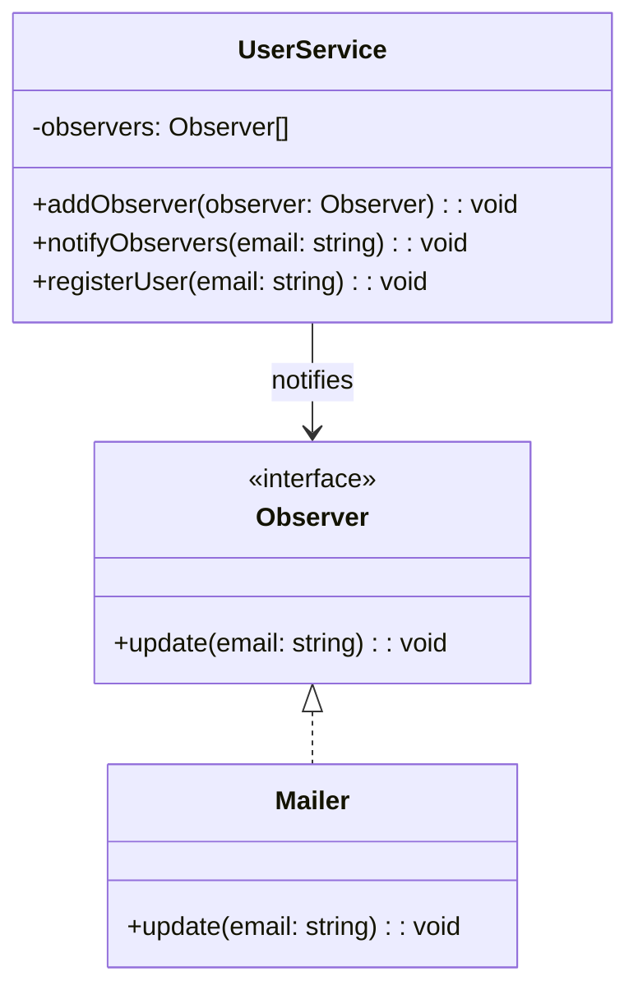

import Tabs from "@theme/Tabs";
import TabItem from "@theme/TabItem";
import CodeBlock from "@theme/CodeBlock";

import tsCode from "@site/src/codes/tight-coupling/ts/rfc_observer.ts";
import phpCode from "@site/src/codes/tight-coupling/php/rfc_observer.php";
import pyCode from "@site/src/codes/tight-coupling/py/rfc_observer.py";

# 🧩 Observer Pattern

## ✅ Intent

- Allow an object to **emit events without knowing who will react to them**
- Enable easy modification and extension by simply adding new listeners

## ✅ Motivation

- Notification targets can be **added or replaced dynamically**
- Separate each concern into its own class, improving **testability and reusability**

## ✅ When to Use

- When you want to decouple event emission from its handling logic
- When the number of notification handlers may increase over time

## ✅ Code Example

<Tabs groupId="language">
  <TabItem value="ts" label="TypeScript">
    <CodeBlock language="ts">{tsCode}</CodeBlock>
  </TabItem>
  <TabItem value="php" label="PHP">
    <CodeBlock language="php">{phpCode}</CodeBlock>
  </TabItem>
  <TabItem value="python" label="Python">
    <CodeBlock language="python">{pyCode}</CodeBlock>
  </TabItem>
</Tabs>

## ✅ Explanation

This code applies the `Observer` pattern to design a system where `UserService` (the subject)  
notifies multiple `Observer` instances (subscribers) of an event.  
The `Observer` pattern defines a one-to-many dependency between objects so that  
when one object changes state, all its dependents are notified automatically.

### 1. Overview of the Observer Pattern

- **Subject**: Maintains a list of observers and notifies them of events

  - Represented by `UserService` in this code

- **Observer**: Interface for all objects that want to receive notifications

  - Represented by `Observer`

- **ConcreteObserver**: Implements the `Observer` interface and defines custom handling logic
  - Represented by `Mailer`

### 2. Key Classes and Their Roles

- `Observer`

  - Common interface for subscribers
  - Declares the method `update(email: string): void`

- `Mailer`

  - A concrete observer that implements `Observer`
  - Implements `update` to send an email notification

- `UserService`
  - The subject that emits notifications
  - Has `addObserver` to register observers
  - Uses `notifyObservers` to notify all registered observers
  - Executes `registerUser`, which triggers the notification process

### 3. UML Class Diagram

### 4. Benefits of the Observer Pattern

- **Loose Coupling**: Subjects and observers are loosely coupled; adding/removing observers does not impact the subject
- **Extensibility**: New observers can be added by simply implementing the `Observer` interface
- **Real-Time Notifications**: Allows real-time propagation of state changes

This design is highly effective in event-driven architectures,  
especially when multiple objects need to be notified of a single change in state.  
It enhances both **maintainability** and **scalability** of the codebase.
