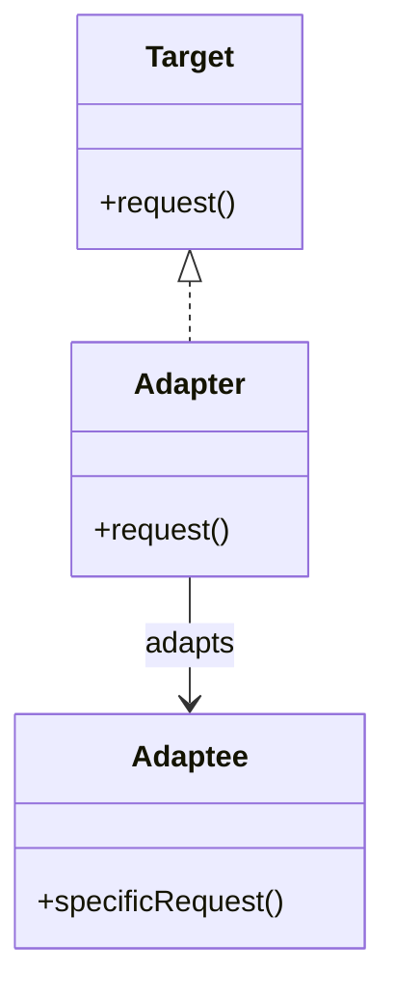
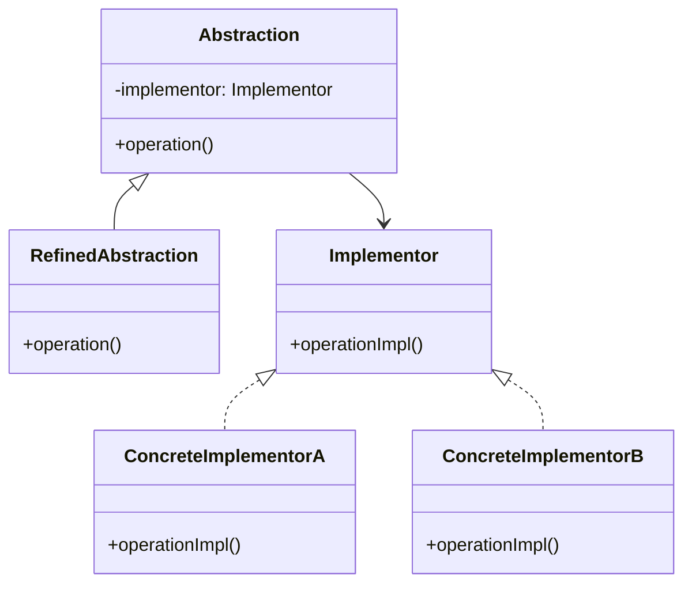

# 🔍 Adapter と Bridge の比較

## ✅ 比較の目的

`Adapter` と `Bridge` はどちらも「インターフェースの変換」や「抽象と実装の切り離し」に関係するため混同されやすい。  
しかし、**「後から合わせる」Adapter** と **「最初から分けて設計する」Bridge** では、目的もタイミングも異なる。  
本節では両者の構造と使い分けの観点を明確にし、設計判断の指針を整理する。

## ✅ 比較の観点

| 比較項目       | Adapter（アダプター）                      | Bridge（ブリッジ）                       |
| -------------- | ------------------------------------------ | ---------------------------------------- |
| 目的           | 既存のインターフェースとの**互換性を確保** | 抽象と実装を**独立に拡張可能**にするため |
| 導入タイミング | 後付け（既存コードに合わせる）             | 設計段階（柔軟な拡張を想定して分離）     |
| 関係の構築     | 1 対 1（既存コードをラップ）               | 多対多（抽象 × 実装の組み合わせ）        |
| 柔軟性         | 限定的（既存に合わせる）                   | 高い（組み合わせの自由度が高い）         |
| 代表例         | レガシー API のラッピング                  | 表示方式と出力手段の切り替えなど         |

## ✅ 類似点

- どちらも**インターフェースを抽象化**し、クライアントからの直接依存を避ける。
- 利用者にとっては「同じインターフェースで操作できる」ように見える。
- 構造的に似たクラス構成になることがある（Wrapper 構造をとる場合など）。

## ✅ 決定的な違い

| 観点           | Adapter                    | Bridge                                 |
| -------------- | -------------------------- | -------------------------------------- |
| 設計意図       | **互換性の確保**           | **柔軟な拡張**                         |
| 利用タイミング | 後付け：既存コードへの対応 | 初期設計段階：拡張を見据えて抽象と分離 |
| 処理の主導権   | 元のクラス（Adaptee）      | 抽象側（Abstraction）                  |
| 拡張性         | 単一変換：1 対 1 が基本    | 組み合わせ：多対多                     |

## ✅ 選び分けの判断軸

- ✅ レガシー API や外部仕様との互換性が必要 → **Adapter**
- ✅ 機能と実装を独立に拡張していきたい → **Bridge**
- ✅ すでにあるコードを新しい構造に適合させたい → **Adapter**
- ✅ 新しい設計で将来的な変化に備えたい → **Bridge**

## ✅ UML クラス図

### Adapter パターン

### Bridge パターン

## ✅ 実務でのヒント

- ✅ **Adapter は「場当たり的な対応」に便利**だが、増えすぎると構造が複雑になる。
- ✅ **Bridge は拡張性の高い設計**だが、初期の設計コストが高くなる傾向がある。
- ▶️ 例：通知の仕組みをレガシー API に適合させる場合は `Adapter`、通知種別（エラー/警告）と送信手段（メール/Slack）を分離したい場合は `Bridge`。

## ✅ まとめ

- `Adapter` は互換性のための **後付けラッパー**
- `Bridge` は柔軟性を重視した **抽象と実装の分離構造**
- 一見似た構造でも、**導入タイミングと拡張方向**に決定的な違いがある
- 設計時の目的に応じて適切に使い分けることが重要
