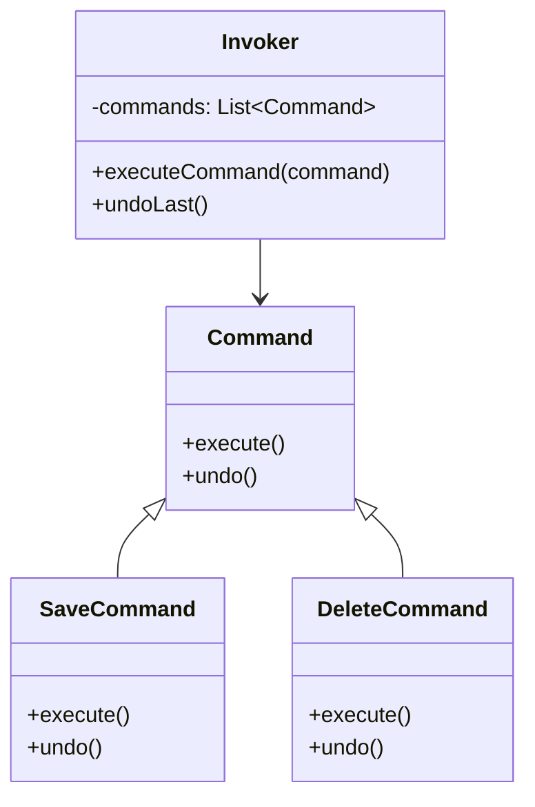
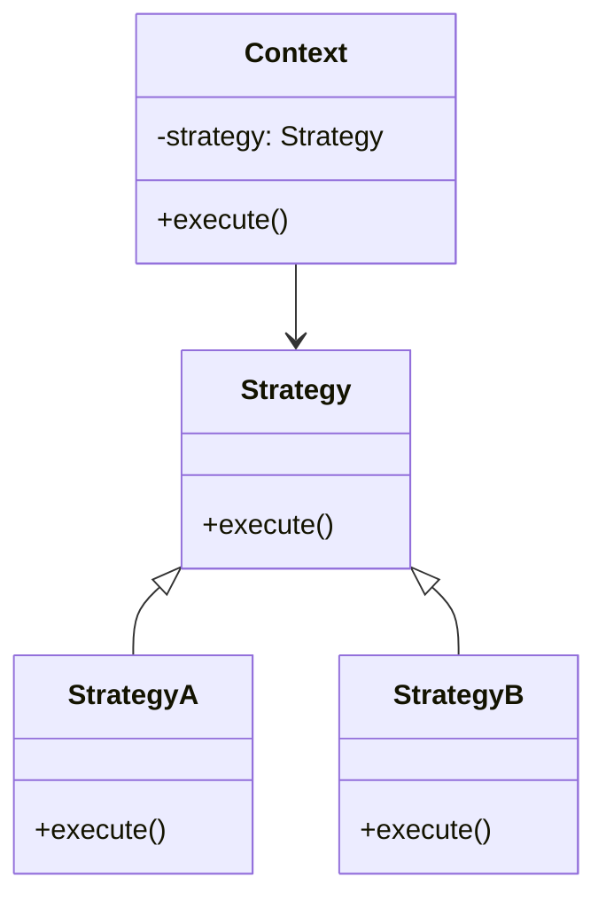

# 🔍 Command と Strategy の比較

## ✅ 比較の目的

`Command` と `Strategy` は、いずれも「処理の抽象化と差し替え」を目的としたパターンであるが、その適用目的や使用場面には明確な違いがある。本比較では、構造や利用目的、実務での応用観点から両者を整理し、設計判断の指針を得ることを目的とする。

## ✅ 比較の観点

| 比較項目   | Command（コマンド）                        | Strategy（戦略）                           |
| ---------- | ------------------------------------------ | ------------------------------------------ |
| 目的       | 処理自体をオブジェクトとしてカプセル化する | アルゴリズムや振る舞いを切り替え可能にする |
| 主な用途   | 履歴管理、Undo/Redo、バッチ処理など        | 処理の柔軟な切り替え、実行時の戦略変更     |
| 構造       | コマンド + 受信者 + 呼び出し元の構成       | 戦略インターフェース + 複数の実装クラス    |
| 再利用性   | 処理単位の再利用がしやすい                 | 振る舞い単位で他文脈でも再利用しやすい     |
| 拡張性     | 新しい処理 = 新しいコマンドクラスを追加    | 新しい振る舞い = 新しい戦略クラスを追加    |
| 典型的な例 | GUI 操作、バッチ処理、Undo 機構など        | 課金方式の切り替え、並び替え処理など       |

## ✅ 類似点

- 処理（動作）をオブジェクトとして抽象化する
- インターフェースを通じて呼び出し可能な共通構造を持つ
- 呼び出し元は、具体的な処理内容を意識せず操作できる
- 実装を差し替えることで動作を柔軟に変更可能

## ✅ 決定的な違い

| 観点         | Command パターン                    | Strategy パターン                    |
| ------------ | ----------------------------------- | ------------------------------------ |
| 目的         | 処理の実行タイミングや履歴の管理    | アルゴリズムや振る舞いの差し替え     |
| 主体         | 「命令」の定義と履歴の管理          | 「処理内容」の選択と注入             |
| 取り消し処理 | `undo()` などで明示的に取り消し可能 | 基本的に取り消しは対象外             |
| 呼び出し役   | Invoker が中心。Command を操作する  | Context が Strategy を切り替えて使用 |
| 主な活用場面 | Undo/Redo、非同期処理、キュー実行   | 処理戦略の切り替え、ポリシー適用     |

## ✅ 選び分けの判断軸

- ✅ **履歴管理や再実行が必要** → `Command`
- ✅ **アルゴリズムや処理方針の切り替え** → `Strategy`
- ✅ **操作単位で抽象化し記録したい** → `Command`
- ✅ **柔軟に処理方式を切り替えたい** → `Strategy`

## ✅ UML クラス図

### Command パターン

### Strategy パターン

## ✅ 実務でのヒント

- ✅ **Command** は、「何をやったか」を記録したい時に最適（バッチ処理、エディタの操作履歴など）
- ✅ **Strategy** は、処理方式を外部から注入・切り替えたい時に便利（通知方式、認証手段など）
- ▶️ **両者を併用することも可能**：バッチ処理の中で通知方法を戦略として切り替えるなど

## ✅ まとめ

- `Command` は「処理そのものをオブジェクト化」して、実行・取り消し・履歴管理ができる
- `Strategy` は「処理のやり方を切り替えるための注入構造」を提供する
- 似た構造ながら、**履歴・操作単位で設計するか／切り替え可能なポリシーとして設計するか** で大きく意味が異なる
