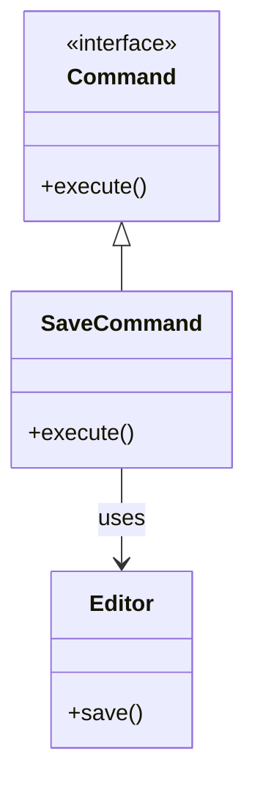
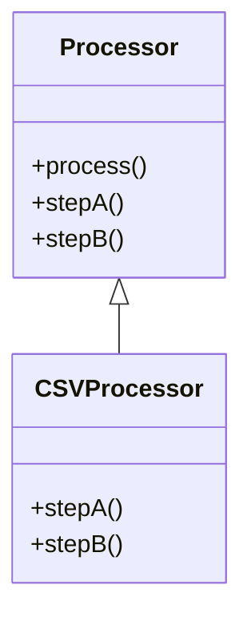

# 🔍 Command と Template Method の比較

## ✅ 比較の目的

Command パターンと Template Method パターンはいずれも「処理の構造化」に有効なパターンであり、特に**処理手順の分離や再利用性の向上**を目指す場面で登場する。  
ただし、**処理を「オブジェクト」として扱いたいかどうか**によって、選ぶべきパターンは異なる。

この比較では、両者の**構造的な違い・柔軟性・テスト性**などに着目し、適切な選択を支援する。

## ✅ 比較の観点

| 比較項目     | Command                                          | Template Method                                  |
| ------------ | ------------------------------------------------ | ------------------------------------------------ |
| 実装方法     | インターフェースとオブジェクトの組み合わせで実装 | 抽象クラスの継承によって実装                     |
| 柔軟性       | 高い（実行時にコマンドを動的に組み替え可能）     | 中程度（手順は固定、特定ステップのみ差し替え）   |
| テスト容易性 | 高い（各コマンド単体でテスト可能）               | 中程度（サブクラスのテストが前提）               |
| 使用目的     | 処理の**遅延実行・履歴管理・操作記録**など       | 処理の流れの**統一と差分の明示**                 |
| 拡張性       | 高い（コマンドを増やせば処理も増やせる）         | 中程度（差分の範囲は限られる）                   |
| 利用スタイル | 処理そのものをオブジェクト化                     | 流れ（テンプレート）は固定、差分はオーバーライド |

## ✅ 類似点

- どちらも処理を**部品化し、差分を分離**することが目的。
- どちらも、**共通の処理枠の中に可変要素を差し込む構造**を持つ。
- 単なる関数の列挙よりも**拡張性・保守性に優れた構造**になる。

## ✅ 決定的な違い

| 観点           | Command パターン                         | Template Method パターン                   |
| -------------- | ---------------------------------------- | ------------------------------------------ |
| 主体           | 呼び出し元が「コマンドを渡して実行」     | 基底クラスが「処理の流れを制御」           |
| 再利用の粒度   | コマンド単位で小さく再利用できる         | クラス単位で処理の枠組みごと使うことが多い |
| 状態管理       | コマンドの状態を保持でき、履歴操作に向く | 状態というより、流れと差分の設計が中心     |
| 実行タイミング | 遅延実行や非同期実行も容易               | 呼び出し時に即時実行される                 |

## ✅ 選び分けの判断軸

- ✅ **「操作を記録・遅延実行したい」場合は → Command パターン**
- ✅ **「処理の手順は決まっていて、一部だけ差し替えたい」場合は → Template Method パターン**
- ✅ ユーザーのアクションをログや履歴として保持したい → Command
- ✅ ワークフローや出力処理など、全体の構成が固定された流れ → Template Method

## ✅ UML クラス図

### Command パターン

### Template Method パターン

## ✅ 実務でのヒント

- ✅ Command は、**履歴管理やアクションのログ化**に向いており、Undo/Redo のような操作には最適。
- ✅ Template Method は、**処理の流れを固定しつつ、一部だけ差し替える構造**に強く、レポート出力やデータ変換処理でよく使われる。
- ▶️ **複雑な処理フロー**を統一したいが、**拡張性や動的な切り替えも必要な場合**、併用（Synergy）も検討価値あり。

## ✅ まとめ

- **Command** は「処理をオブジェクト化して、操作単位で管理」したいときに最適。
- **Template Method** は「処理の枠組みを固定し、差分だけカスタマイズ」したいときに効果的。
- 設計時には、**柔軟性の必要度、処理の粒度、拡張方向**を見極めることが重要となる。
