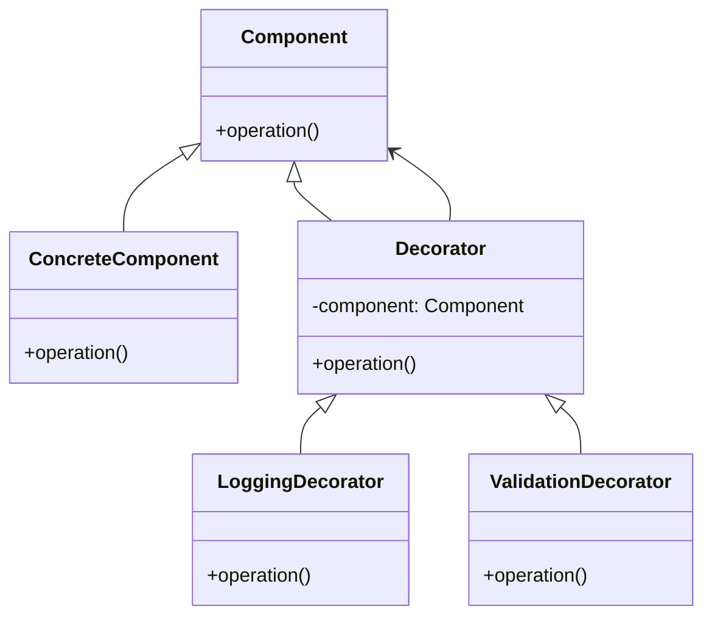
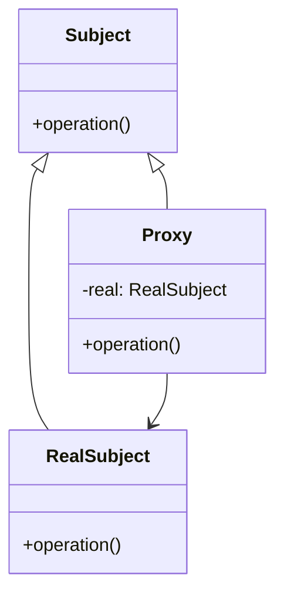

# 🔍 Decorator と Proxy の比較

## ✅ 比較の目的

`Decorator` と `Proxy` は、どちらも **他のオブジェクトと同じインターフェースを持つクラスを用いて振る舞いを拡張または制御する** パターンである。構造的にはよく似ているが、**目的・適用タイミング・責務の持ち方に明確な違い**がある。本節では、その違いと使い分けの判断軸を整理する。

以下は、**Decorator vs Proxy** の比較表（日本語版）です。

## ✅ 比較の観点

| 比較項目         | Decorator（デコレーター）                      | Proxy（プロキシ）                              |
| ---------------- | ---------------------------------------------- | ---------------------------------------------- |
| 目的             | 機能追加・動的な振る舞いの拡張                 | アクセス制御・キャッシュ・遅延処理などの制御   |
| 構造             | 同じインターフェースを持ち、**処理を包み込む** | 同じインターフェースを持ち、**アクセスを仲介** |
| 主な用途         | ログ追加・認可チェック・UI 構成の動的変更など  | キャッシュ・認証・リモート呼び出しなど         |
| オブジェクト生成 | 明示的にラップして機能を追加                   | 内部的に `RealSubject` をラップ                |
| 実行制御         | 振る舞いの**拡張**が主目的                     | 振る舞いの**制御・監視**が主目的               |
| 実行タイミング   | 処理の**前後に挿入される**ことが多い           | 処理の**前にチェックや条件判定**を入れる       |
| 利用シーン       | 機能を追加したいとき（UI やログなど）          | 実体を守りたいとき（認証・キャッシュなど）     |

## ✅ 類似点

- **共通のインターフェースを持つクラスをラップする構造**
- オブジェクトの**前後処理や条件付き処理を追加可能**
- クライアントコードから見ると、**どちらも同じインターフェースで利用できる**

## ✅ 決定的な違い

| 観点           | Decorator                                | Proxy                                          |
| -------------- | ---------------------------------------- | ---------------------------------------------- |
| 目的           | **機能の追加・装飾**                     | **アクセス制御・遅延初期化・監視など**         |
| 責務の主軸     | 元の処理に**追加の機能を与える**         | 本体への**制御されたアクセス**を提供           |
| 使用タイミング | 追加処理を重ねていきたい時               | 本体の生成を遅らせたい／アクセスを監視したい時 |
| 実行主体       | 実際の処理は常に本体（元のクラス）に委譲 | 条件に応じて処理を実行しないこともある         |

## ✅ 選び分けの判断軸

- ✅ **機能追加・拡張を目的とする** → `Decorator`
- ✅ **アクセス制御・条件付き実行を目的とする** → `Proxy`
- ✅ **複数の装飾処理を重ねたい** → `Decorator`
- ✅ **ログ・認証・キャッシュ制御を挟みたい** → `Proxy`

## ✅ UML クラス図

### Decorator パターン

### Proxy パターン

## ✅ 実務でのヒント

- ✅ `Decorator` は機能の「足し算」が得意で、ログ出力や表示装飾などの **段階的な追加** に適している。
- ✅ `Proxy` は条件分岐・制御の「フィルター」として機能し、認証やキャッシュなどの **実行制御** に向いている。
- ▶️ 例：画面に表示するコンポーネントに対して複数の装飾を施す場合は `Decorator`、API アクセスにログや認証を加えたい場合は `Proxy` が有効。

## ✅ まとめ

- `Decorator` は **処理の追加・拡張** による振る舞いの変化を目的とする
- `Proxy` は **制御や遅延評価** を通じてアクセス方法を最適化する構造
- どちらもラップ構造を持つが、**「主目的」がまったく異なる**
- **ユースケースと責務の主軸**に応じて、明確に使い分けるべきパターンである
