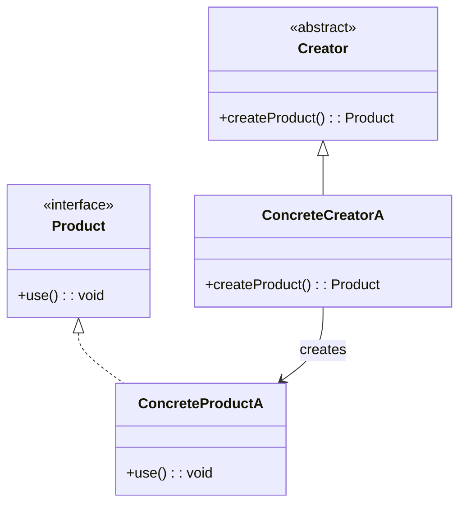
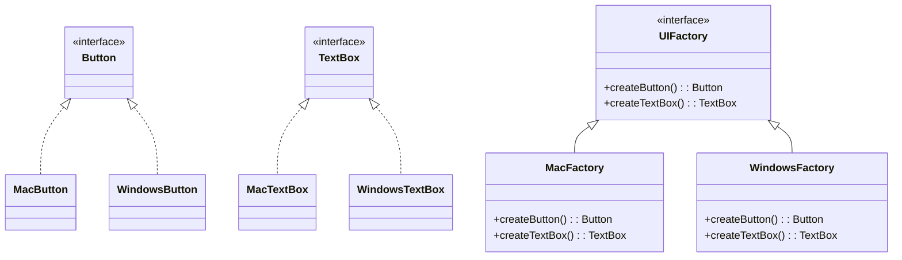

# 🔍 Factory Method と Abstract Factory の比較

## ✅ 比較の目的と前提

`Factory Method` と `Abstract Factory` はどちらも「オブジェクト生成」に関するデザインパターンであり、  
**生成処理の委譲によって依存を減らす**という点で共通している。

ただし、**「単一の生成」なのか「一式の関連生成」なのか**によって適用範囲や構造が大きく異なるため、  
それぞれの違いと選び分けの判断軸を明確にする。

## ✅ 比較の観点

| 比較項目     | Factory Method                         | Abstract Factory                                    |
| ------------ | -------------------------------------- | --------------------------------------------------- |
| 生成単位     | 単一のオブジェクト                     | 関連する一式のオブジェクト（ファミリー）            |
| 柔軟性       | 高い（サブクラスで生成処理を切り替え） | 高い（製品群の切り替えを統一的に制御できる）        |
| 拡張性       | 単一製品に最適                         | 製品のバリエーションが複数あるときに有効            |
| 実装の複雑さ | 比較的シンプル                         | やや複雑（依存関係が増える）                        |
| 典型的な用途 | UI 部品やファイルパーサの生成          | OS/テーマごとの UI 部品セットなど、統一感ある生成群 |

## ✅ 類似点

- **インスタンス生成をクライアントから分離**し、具象クラスへの依存を排除する。
- `new` を直接使わず、**ファクトリーメソッド経由でインスタンス化**する点が共通。
- 実装クラスを柔軟に差し替えられるようにするためのパターン。

## ✅ 決定的な違い

| 観点             | Factory Method                           | Abstract Factory                                       |
| ---------------- | ---------------------------------------- | ------------------------------------------------------ |
| 対象             | 1 つの製品                               | 複数の関連製品（ファミリー）                           |
| 実装構成         | 生成メソッドをサブクラスでオーバーライド | 複数のファクトリーメソッドを含むインターフェースを提供 |
| 拡張の単位       | 製品単位                                 | 製品群ごとのバリエーション                             |
| 実行時切り替え   | 部分的に可能                             | 製品群ごとの一括切り替えが可能                         |
| 抽象化のスコープ | 単一の生成関数レベル                     | ファクトリークラス全体                                 |

## ✅ 選び分けの判断軸

- ✅ **単体の生成だけでよい →** Factory Method
- ✅ **一貫性のある複数生成が必要 →** Abstract Factory
- ✅ **将来テーマやバリエーションごとに製品を切り替えたい →** Abstract Factory
- ✅ **柔軟に特定の生成処理だけ変えたい →** Factory Method

## ✅ クラス図

### Factory Method パターン

### Abstract Factory パターン

## ✅ 実務でのヒント

- ✅ `Factory Method` は構成要素がシンプルな場面（例：通知送信オブジェクトの生成）に有効。
- ✅ `Abstract Factory` は「製品群」の切り替えが必要なアプリ（例：ダークテーマ vs ライトテーマ）に向いている。
- ▶️ UI ライブラリやテーマ対応、デバイス別インスタンス生成などで登場頻度が高い。

## ✅ まとめ

- **Factory Method** は「単品をどう作るか」の戦略切り替え
- **Abstract Factory** は「一式をまるごと切り替える」構造的な選択肢
- 柔軟性・拡張性はどちらにもあるが、**生成対象の粒度**と**変更の方向性**で選び分けることが重要
