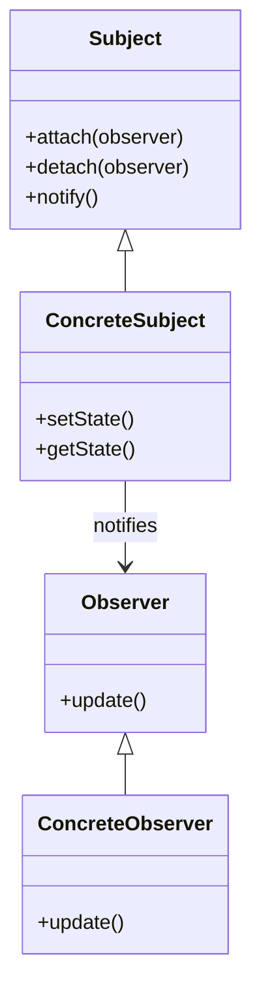
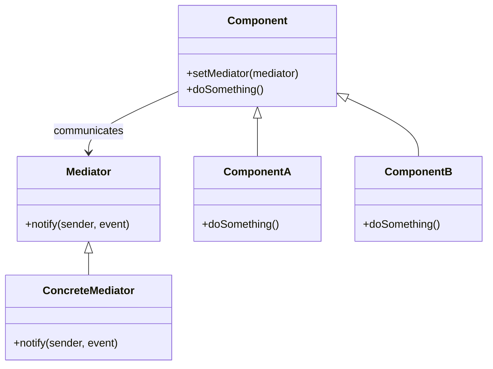

# 🔍 Observer と Mediator の比較

## ✅ 比較の目的

`Observer` と `Mediator` は、どちらもオブジェクト間のやりとりを整理するパターンですが、  
**「通知を分散する」のか「やりとりを集中管理する」のか** という点で構造的な違いがあります。  
本比較では、両者の構造・適用目的・拡張性を明確にし、選定の判断材料とします。

## ✅ 比較の観点

| 比較項目   | Observer（オブザーバー）                  | Mediator（メディエーター）                            |
| ---------- | ----------------------------------------- | ----------------------------------------------------- |
| 目的       | あるオブジェクトの状態変化を他に通知する  | オブジェクト同士のやり取りを中央で調整する            |
| 主な用途   | 状態変化の通知、リアクティブ UI           | 複数コンポーネントの連携制御、チャット・UI 連動など   |
| 構造       | Publisher が Subscriber を保持・通知      | Mediator が複数の Participant を仲介                  |
| 再利用性   | 通知の送受信ロジックを分離して再利用可能  | コンポーネントを Mediator 非依存で再利用可能          |
| 拡張性     | Subscriber を追加するだけで反応を拡張可能 | Mediator の実装を変更すれば連携ロジックを一括制御可能 |
| デメリット | 通知の連鎖・依存が複雑になりやすい        | Mediator が肥大化しがち                               |

## ✅ 類似点

- 複数オブジェクトの連携を扱うパターン
- 状態変化や操作の伝播をトリガーに処理を起動
- 直接の結合を避けて、疎結合な設計を実現する

## ✅ 決定的な違い

| 観点       | Observer                         | Mediator                                  |
| ---------- | -------------------------------- | ----------------------------------------- |
| 通信の方向 | **一方向**（Subject → Observer） | **双方向または多方向**（全員 ↔ Mediator） |
| 中央集権性 | なし（分散通知）                 | あり（集中制御）                          |
| 拡張性     | 増加するほど複雑化しやすい       | Mediator 内に集約すれば整理しやすい       |
| 結合の構造 | 多対多の依存が広がる可能性       | 中央経由により依存の数を抑えられる        |
| 主な用途   | 状態変化の通知（UI, 計測など）   | 複雑なやりとりの仲介（チャット、UI 連携） |

## ✅ 選び分けの判断軸

- ✅ **変化の通知を分散したい** → `Observer`
- ✅ **複数の参加者を中央でまとめたい** → `Mediator`
- ✅ **イベント駆動で反応させたい** → `Observer`
- ✅ **やり取りのフローを構造化したい** → `Mediator`

## ✅ UML クラス図

### Observer パターン

### Mediator パターン

## ✅ 実務でのヒント

- ✅ **Observer** はリアルタイム更新（UI 変更やメトリクス通知など）に便利。ただし、オブザーバが増えすぎると**制御が困難**になる。
- ✅ **Mediator** は**複数コンポーネントが相互に依存**するような場面で活躍。通知対象やフローが複雑なときに選択肢となる。
- ▶️ 例：状態変化を複数パーツに伝えるだけなら `Observer`、各 UI コンポーネントの操作をまとめて制御するなら `Mediator`

## ✅ まとめ

- `Observer` は「状態変化の**通知**」を目的とし、**分散構造での反応設計**に適している
- `Mediator` は「やり取りの**調停**」を目的とし、**複数の依存を 1 箇所で整理**できる
- どちらも依存を減らすが、**分散 vs 集約** という大きな構造方針の違いに注意
