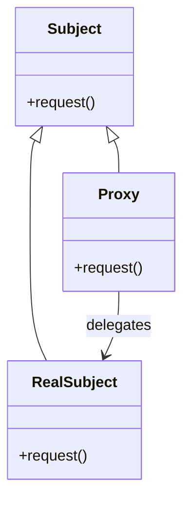
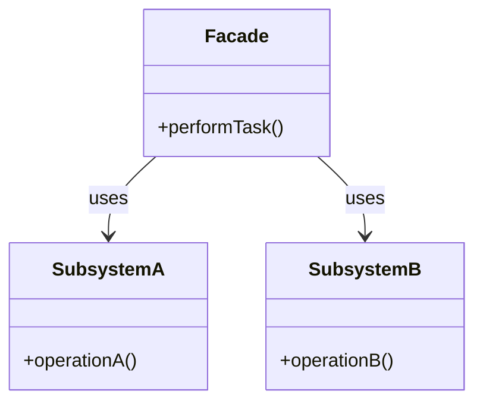

# 🔍 Proxy と Facade の比較

## ✅ 比較の目的

`Proxy` と `Facade` は、いずれも「間に立つオブジェクト」を定義するという点で似た構造を持つが、目的と設計の意図はまったく異なる。  
この比較では、**責務の違い**と**構造的な設計意図**の差異に注目し、選定の指針を明確にする。

## ✅ 比較の観点

| 比較項目     | Proxy（プロキシ）                                       | Facade（ファサード）                              |
| ------------ | ------------------------------------------------------- | ------------------------------------------------- |
| 目的         | 本体へのアクセス制御や前処理・後処理の挿入              | 複雑な処理を単純なインターフェースで提供          |
| 主な用途     | アクセス制御、遅延初期化、キャッシュ、ログ記録など      | 複数の処理・モジュールを統合した簡潔な呼び出し    |
| 構造         | 本体と同じインターフェースを実装し、処理を中継          | 複数クラスを内部に持ち、外部には簡潔な API を公開 |
| 対象の数     | 1 対 1（単一オブジェクトを代理）                        | 多対 1（複数の処理をまとめる）                    |
| 利用者の意識 | 利用者は Proxy 経由で操作していることに気づかないことも | 利用者は Facade を通じて複雑さから解放される      |
| 拡張性       | 特定処理の前後に制御ロジックを追加しやすい              | 内部構造を隠蔽したまま外部 API を変更可能         |

## ✅ 類似点

- どちらも「ラッパーオブジェクト」を用いて別のオブジェクトへのアクセスを抽象化
- クライアントコードのシンプル化や疎結合化に貢献する
- サブシステムや実体オブジェクトの**外部との接点**を担う

## ✅ 決定的な違い

| 観点           | Proxy                                            | Facade                                         |
| -------------- | ------------------------------------------------ | ---------------------------------------------- |
| 目的           | アクセス制御、遅延初期化、ロギング、キャッシュ等 | 複雑な処理の統合と単純化                       |
| 使用タイミング | 実体が高コスト or 保護が必要な場合               | 処理手順や構成が複雑で利用側を簡素化したい場合 |
| 主体となる処理 | 原則として RealSubject の代替・仲介              | Facade 自身が複数の処理やモジュールを制御する  |
| 構造           | RealSubject と同一インターフェース               | 複数の内部 API をまとめた独自インターフェース  |
| 拡張性         | 振る舞いの前後に処理を挿入しやすい               | 内部構造を隠蔽しながら全体的な整理ができる     |

## ✅ 選び分けの判断軸

- ✅ オブジェクトの操作前後に処理（ログ、認証など）を挟みたい → **Proxy**
- ✅ 外部公開インターフェースを一元化して簡素にしたい → **Facade**
- ✅ アクセスそのものを制御したい（遅延評価、キャッシュ） → **Proxy**
- ✅ 複雑な下位処理をまとめた API を構築したい → **Facade**

## ✅ UML クラス図

### Proxy パターン

### Facade パターン

## ✅ 実務でのヒント

- ✅ `Proxy` は**単一オブジェクトの挙動制御**に向いており、API アクセス、リモート操作、セキュリティチェック、キャッシュ挿入などに活用される。
- ✅ `Facade` は**複雑なサブシステムの入り口を整理する**ため、複数サービスをまたぐビジネス処理や、ライブラリのラッパー構築に向いている。
- ▶️ 例：データ取得のキャッシュや認証付き API アクセス → `Proxy`／社内複数システムを統合した社外向けインターフェース → `Facade`

## ✅ まとめ

- `Proxy` は **アクセスの制御や拡張** に特化した仲介役
- `Facade` は **複数処理の集約と単純化** に特化した窓口
- 両者とも構造は似ているが、**目的と責務の重心がまったく異なる**
- 設計時には「対象が単一か複数か」「主眼が制御か簡略化か」を軸に使い分けるべき
